layout: true

`r paste0("
", params$event, " 

")`

---

class: center, middle

Ces slides en ligne :
`r paste0("http://datactivist.coop/", params$slug)`

Sources : `r paste0("https://github.com/datactivist/", params$slug)`

Les productions de Datactivist sont librement réutilisables selon les
termes de la licence [Creative Commons 4.0
BY-SA](https://creativecommons.org/licenses/by-sa/4.0/legalcode.fr).

   

---

### Programme de la formation

#### Open Data : l'ouverture des données publiques culturelles .red[en pratique]

-   Concevoir une stratégie open data
-   Identifier des données à ouvrir
-   Les formats de données
-   Mettre en qualité des données
-   Publier des données culturelles et produire des métadonnées de qualité
-   Animer un projet d'open data et inciter à la réutilisation de
    données
-   Gérer la relation avec les (ré)utilisateurs

---

### Aujourd'hui, vous allez .red[apprendre à :]

#### Concevoir une stratégie Open Data

#### Comprendre la qualité nécessaire pour publier des données

#### Préparer des données et s'initier au travail nécessaire à la publication

#### Évaluer des opportunités d'ouverture de données

#### Animer et valoriser la réutilisation

---

class: inverse, center, middle

# 1. Quelques rappels pour commencer : L'essentiel de l'open data en 15 minutes

---

### Avant d'approfondir la pratique, voici un .red[bref retour sur les bases]

- Comment définissez-vous l'open data ?
- Quels sont les enjeux de l'open data ?
- Quelles données peuvent être ouvertes dans le domaine de la culture ?

---

### Une ou plusieurs définitions ?

-   **L'open data** se définit comme : "des données devant être
    accessibles gratuitement, dans un format utilisable et modifiable
    pour servir tout objectif." D'après la définition du **savoir
    ouvert**, [l'open definition](http://opendefinition.org/od/1.1/fr/)

-   **L'open content** va concerner l'ouverture des contenus culturels
    en eux-mêmes

Par exemple : l'open data va consister en l'ouverture des inventaires
d'oeuvres et l'open content en l'ouverture des images des oeuvres. Dans
les deux cas :

.red[**Ouverture = mise à disposition + possibilité de réutilisation**]

---

### Les enjeux

-   La transparence de la vie publique et la participation citoyenne à
    l'action publique
-   L'efficacité de l'action publique : amélioration de la qualité des
    services publics
-   Le développement de l'attractivité des territoires
-   Le soutien à l'innovation économique et sociale
-   Une opportunité en matière de démocratisation culturelle et de
    transmission des savoirs

---

### Culture : principales catégories de données .red[concernées par l'ouverture]

-   Les **données statistiques** des institutions culturelles :
    fréquentation, entrées, liste des équipements
-   Les **bases de données des collections** : métadonnées et plus
    largement les données associées aux œuvres (localisation,
    description, auteur, œuvres associées, prix, propriétaire)
-   Les **contenus numérisés** (ou nativement numériques): images des
    tableaux, archives, photos, sons, vidéos
-   Les **listes de structures** : musées, monuments, cinéma, etc.
-   Les **référentiels ou nomenclatures** : vocabulaires controlés,
    thesaurii etc.
-   Les données de type **agenda** : événements, programmations
-   Les **données financières** : financement, ressources, budgets
    annuels, subventions

> Important : pour la mise à disposition des oeuvres (numérisées ou nativement numériques), il faut tenir compte du droit de propriété intellectuelle avant l'ouverture.

---
class: inverse, center, middle

> ### Derrière chaque fichier se cache une découverte
---

class: inverse, center, middle

# 1 - Concevoir une stratégie open data

---

### Réussir .red[sa stratégie d'ouverture] de données

- Au-delà de l'obligation légale : .red[**poser les objectifs**] poursuivis par la stratégie

- Se donner les moyens de connaître la .red[**demande de données**] pour y répondre

- Travailler à la .red[**qualité des données**], garante d'usages réels
    
- Mener le projet d'ouverture comme un .red[**projet de modernisation**]

---

### Les politiques open data .red["de l'offre"]

.pull-left[
#### En théorie

> #### Toutes les données sont ouvertes sous leur forme brute dès leur production

]
.pull-right[

#### En pratique

> #### L’administration choisit quelles données ouvrir, comment les ouvrir, quand les ouvrir et ce qu’elles contiennent

]
---

### Les conséquences pour .red[les réutilisateurs :]

#### Un parcours fait de frictions et de déceptions

.pull-left[
]
.pull-right[

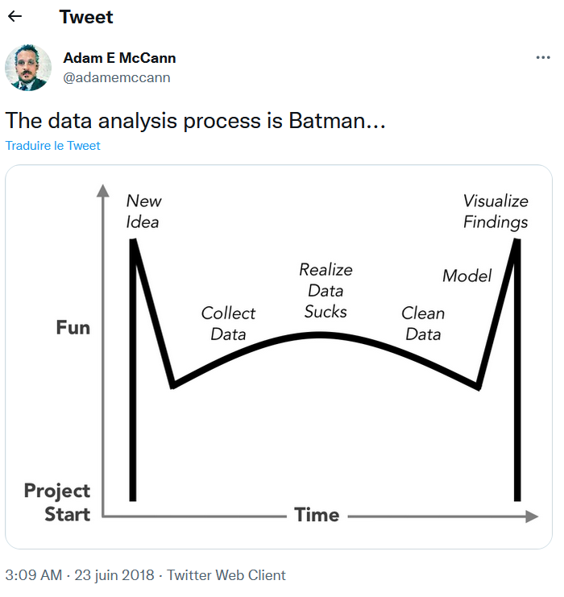
]

---

class: inverse, center, middle

# 2 - Les étapes de l'ouverture des données

---

class: middle

### Comment ouvrir ses données : .red[les différentes étapes] pratiques à suivre

-   **Étape 1** : Sélectionner les données
-   **Étape 2** : Préparer les données
-   **Étape 3** : Diffuser et valoriser les données

---

class: inverse, center, middle

## Etape 1 : Sélectionner les données

---

### Étape 1 : .red[Selectionner les données]

1.1 Effectuer un état des lieux permettant de faire .red[**l'inventaire des données existantes.**] Cette opération permet également d'identifier d'éventuelles contraintes à l'ouverture et ainsi d'envisager les actions concrètes à mener.

> Une cartographie de données a pour objectif de recenser les données
> issues d'un ou de plusieurs système d'information afin d'améliorer la
> connaissance d'un patrimoine de données potentiel.

.center[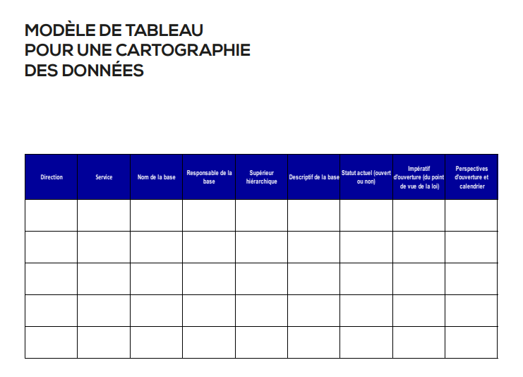]

---
class: center, middle

# Exercice de cartographie

A partir du support partagé : compléter la cartographie avec les données de votre service.
---

### Étape 1 : .red[Selectionner les données à ouvrir en priorité]

1.2 .red[Cette sélection se fait en fonction des objectifs et des moyens de votre structure].

> Il y a plusieurs possibilités : se conformer à une stratégie formalisée, suivre les demandes des communautés de réutilisateurs...

## .center[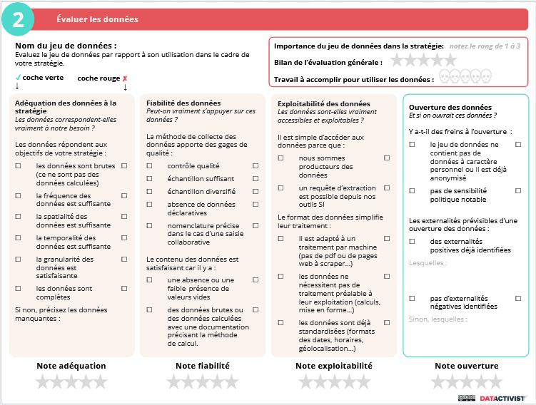]

---
class: center, middle

# Exercice d'évaluation des données et de priorisation

1. Prenez connaissance de la cartographie fictive

--

2. Evaluer les jeux de données

--

3. Prioriser l'ouverture suivant les objectifs de votre structure
---

class: inverse, center, middle

## Etape 2 : Préparer les données

---
### Etape 2 : Préparer les données
#### 2.1 Choisir un .red[format ouvert]

Les données doivent être téléchargeables dans un « standard ouvert », c'est à dire dans un format ouvert aisément réutilisable et exploitable par un système de traitement automatisé et pérenne. Les formats ouverts favorisent l’intéropérabilité : les données pourront être réutilisées indépendamment du logiciel qui a été utilisé pour les créer.

Voici quelques exemples de formats « ouverts » conseillés pour la diffusion des jeux de données en ligne : 

* **Texte brut** : ASCII (.txt)
* **Texte formaté** : TeX (.tex), OpenDocument Text (.odt), Hypertext Markup
Language (.htm ou .html), XHTML (.xhtml), Feuilles de style en cascade (.css)
* **Images** : png (.png), jpeg (.jpg ou .jpeg)
* **Données brutes** : CSV (.csv) / sans extension, JSON (.json), XML (.xml)
* **Données géographiques** : KML (.kml), SHP (.shp)

---

### Accessibilité des formats des données .red[pour les humains et pour les machines]

.center[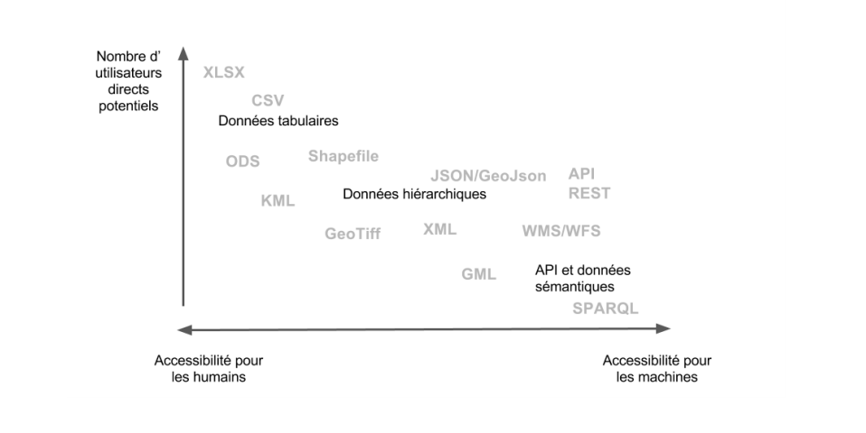]

Source : Françoise Paquienséguy, Valentyna Dymytrova. Livrable 1.2 Analyse de portails métropolitains de données ouvertes à l’échelle internationale. Rapport de recherche 1.2, Equipe d’accueil lyonnaise en Sciences de l’information et de la communication. 2017. [hal-01449348](https://hal.archives-ouvertes.fr/hal-01449348)

---

### L'importance de la .red[qualité des données]

#### .red[Une remarque récurrente :]

> **Les données publiques sont souvent incomplètes, non actualisées, de
> mauvaise qualité et fragmentaires.**

> Dans la plupart des cas, les catalogues ou portails de données
> ouvertes sont alimentés manuellement, conséquence d'une approche
> informelle de la gestion des données.

> De plus, les procédures, les calendriers et les responsabilités des
> institutions publiques chargées de leur gestion manquent souvent de
> clarté. Ainsi, de manière générale, la gestion et la publication des
> données ouvertes sont fragiles et sujettes à des erreurs multiples.

Source : [Rapport mondial du 4e Open Data
Barometer](https://opendatabarometer.org/4thedition/report/?lang=fr)

---
### Etape 2. Préparer les données
#### 2.2 Mettre en .red[qualité] les données

Quelques principes à retenir :

* Mettre à disposition des séries chronologiques les plus longues possibles avec la granularité la plus fine, tout en respectant le secret de la vie privée et le secret statistique ; 
* Compléter vos fichiers par les données de géolocalisation quand cela est possible ;
* Compléter l'adresse postale par le code INSEE (afin de faciliter la géolocalisation dans le cas des noms de villes homonymes) ;
* Utiliser la norme ISO 8601 pour les dates, format : « AAAA-MM-JJ ».
* Faciliter au maximum le traitement par les réutilisateurs : uniformiser les saisies, rendre le fichier traitable par des machines...

---

### OpenRefine : .red[le meilleur ami de la communauté GLAM]

> **OpenRefine est un outil gratuit de traitement de données en masse**

> Il se télécharge sur l'ordinateur et permet de faire des opérations de traitement de données sur de gros fichiers, qu'Excel ne peut pas traiter. 

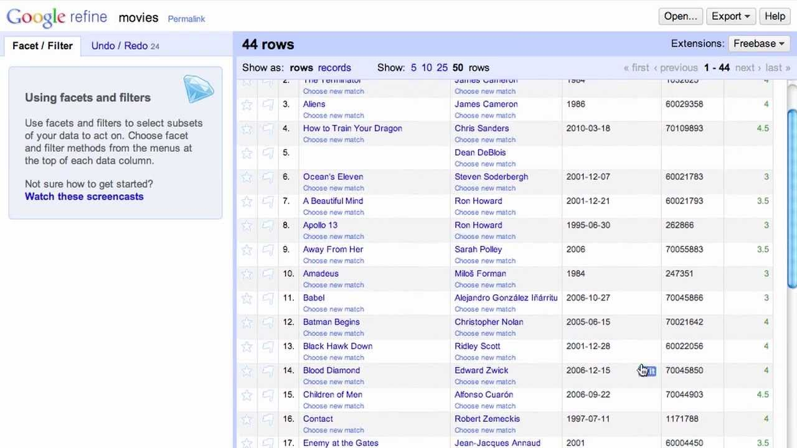

---

class: center, middle

# Open refine

Démo

---
class: inverse, center, middle

## Étape 3 : Diffuser et valoriser les données
---

### Étape 3 : .red[Diffuser et valoriser] les données

#### 3.1 Standardiser ses données

#### 3.2 Bien documenter ses données pour rendre ses données découvrables

#### 3.3 Utiliser la bonne plateforme

---
### Étape 3 : .red[Diffuser et valoriser] les données

#### Etape 3.1 Standardiser les données .red[si possible]

La standardisation permet de définir une description commune à plusieurs producteurs et pour des données de même type.

Un exemple : .red[le standards des données des registres d'entrées d'archives]

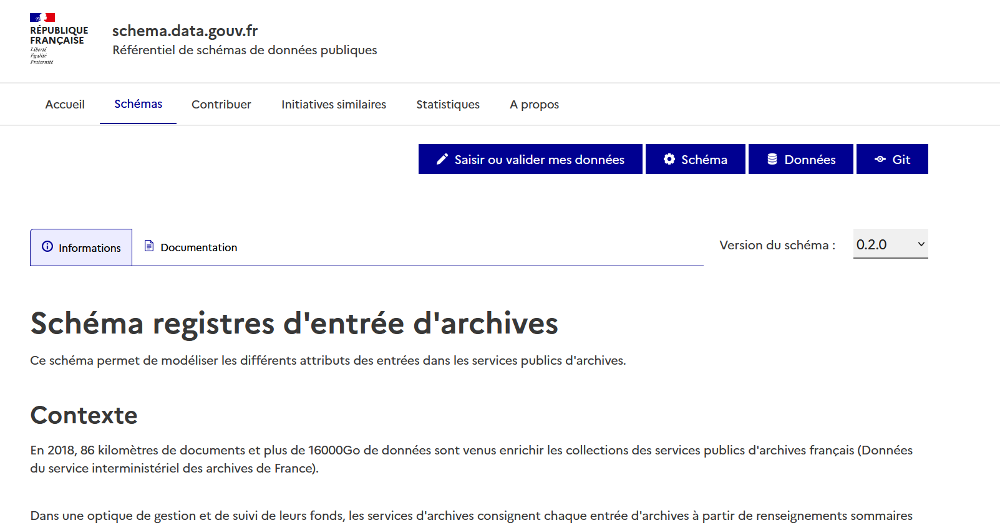

---

### Exercice : .red[réalisez un fichier .csv de qualité]

> **À vous maintenant** !

-   Utilisez les bonnes pratiques et apprenez à réaliser un fichier de
    type tableur sans erreur
-   Puis, à produire ensuite un fichier .CSV répondant aux critères de
    publication en open data

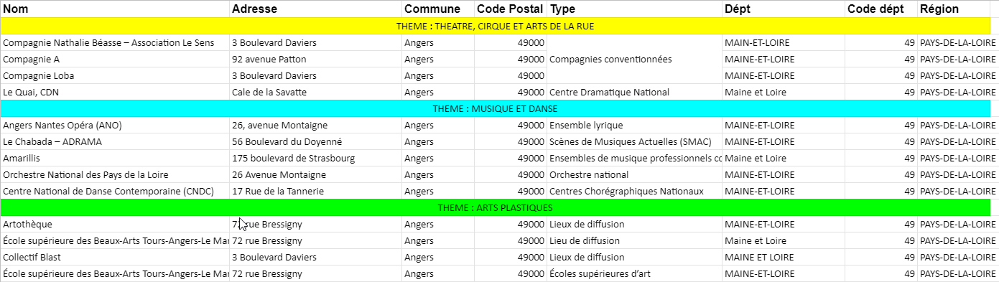

---

### Étape 3 : .red[Diffuser et valoriser] les données

#### 3.2 Documenter les données

Des données mal décrites vont être introuvables et donc, elles ne seront pas utilisées.

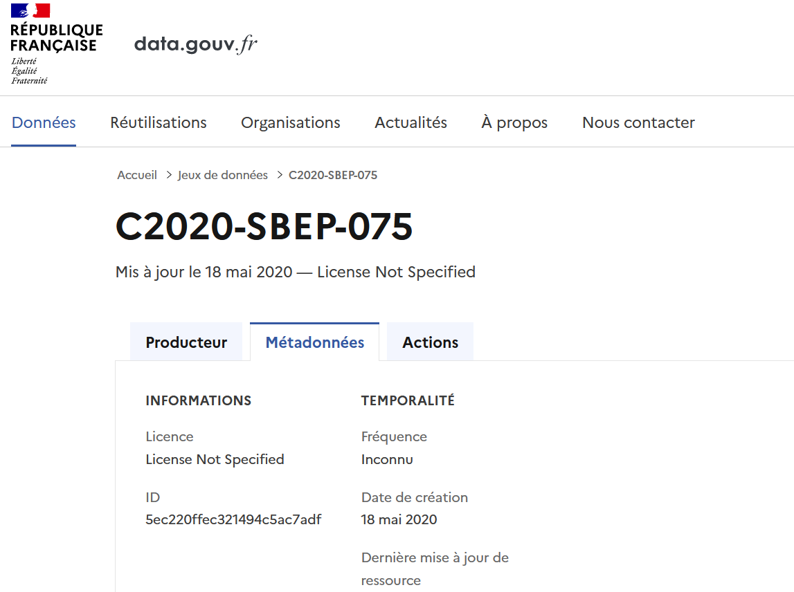

---

### Étape 3 : .red[Diffuser et valoriser] les données

#### 3.2 La découvrabilité : un .red[enjeu crucial]

.pull-left[

]
.pull-right[
"La découvrabilité des données est un défi majeur. Nous avons des portails et des registres de données, mais les organismes gouvernementaux qui relèvent d'un seul gouvernement national publient toujours les données de différentes façons et à différents endroits (...).

**La découvrabilité des données est une condition préalable pour que les données ouvertes réalisent leur potentiel. Or, actuellement la plupart des données sont très difficiles à trouver**."]

.footnote[Source : [Classement mondial de l'Open Data](https://index.okfn.org/insights/)]

---

### Étape 3 : .red[Diffuser et valoriser] les données

#### 3.2 Rendre les données découvrables

> "Les métadonnées sont de l'information structurée qui décrit,
> explique, localise ou facilite autrement l'obtention, l'utilisation ou
> la gestion d'une ressource d'information. Les métadonnées sont souvent
> appelées données des données ou information sur l'information."

Source : National Information Standards Organization
<http://www.niso.org/publications/press/UnderstandingMetadata.pdf>

> **Les Métadonnées descriptives décrivent une ressource à des fins de
> découverte et d'identification.**

---
class: center, middle

# Exercice de description

A partir du template *Documenter un jeu de données* et du jeu de données *exercice_métadonnees*.

---

### Étape 3 : .red[Diffuser et valoriser] les données

#### 3.2 Rendre les données découvrables

En complément des métadonnées, d'autres actions peuvent être menées :
- Choix de mots clés pertinents
- Organisation en thématique
- Harmonisation des choix

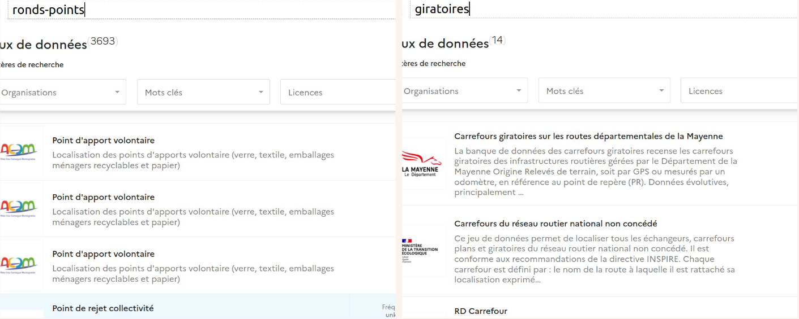
---

### Étape 3 : .red[Diffuser et valoriser] les données

#### Choisir la bonne licence

**Cas 1** :

Mon institution souhaite respecter strictement le cadre légale. Quelle(s) licence(s) je lui recommande ?

---

### Étape 3 : .red[Diffuser et valoriser] les données

#### Choisir la bonne licence

**Cas 2** :

Mon institution souhaite favoriser la réutilisation des données et des contenus, mais elle dispose de très nombreuses données pour lesquelles des auteurs refusent les réutilisations commerciales. Quelle(s) licence(s) je lui recommande ?

---

### Étape 3 : .red[Diffuser et valoriser] les données

#### Choisir la bonne licence

**Cas 3** :

Mon institution souhaite différencier les types de réutilisations (commerciales ou non) et mettre en place une redevance. Quelle(s) licence(s) je lui recommande ?

---

### Étape 3 : .red[Diffuser et valoriser] les données

#### 3.4 Utiliser la bonne plateforme de publication

.red[Le portail data.culture.gouv.fr]

Le portail des données ouvertes du ministère de la Culture met à
disposition les données de l'administration centrale, d'une DRAC ou d'un
SCN, référence les données des établissements publics et moissonne
automatiquement ces données sur data.gouv.fr, pour pouvoir les exposer
sur les deux plateformes à la fois.

*Pour toute information sur la mise à disposition de nouveaux jeux de
données, contacter le département de l'innovation numérique (SG/SCPCI)
via l'onglet « Contact » de la plateforme data.culture.gouv.fr.*

---

### Étape 3 : .red[Diffuser et valoriser] les données

#### 3.4 Utiliser la bonne plateforme de publication

.red[Le portail data.gouv.fr]

Pour les établissements publics, la mise à disposition des données est à
effectuer sur le site .red[data.gouv.fr.]

Afin d'améliorer la visibilité des données culturelles, le ministère
référence également les données des établissements sur la plateforme
ministérielle data.culture.gouv.fr.

Cela implique la création d'une page dédiée à l'établissement, puis la
publication des jeux de données conformément [aux modalités précisées
par
Etalab](https://doc.data.gouv.fr/jeux-de-donnees/publier-un-jeu-de-donnees/)

> **Le ministère mettra en place les mécanismes nécessaires pour que
> toutes les données publiées de cette façon soient ensuite
> automatiquement visibles sur data.culture.gouv.fr.**

 

---

class: inverse, center, middle

# Animer et valoriser les réutilisations

---

class: middle

### Étape 4 : .red[Animer et valoriser] les réutilisations

#### En interne à votre structure

* Utiliser des données ouvertes

#### En externe à votre structure

* Animer une communauté de réutilisateurs
* Nouer des partenariats
* Favoriser les réutilisations
* Valoriser les réutilisations

---

class: middle

### Étape 4 : .red[Animer et valoriser] les réutilisations

Intégrer la réutilisation de données à votre établissement 

Carte des AD13 qui utilise les données de Wikidata pour présenter les [fonds communaux conservés](intercommunales)

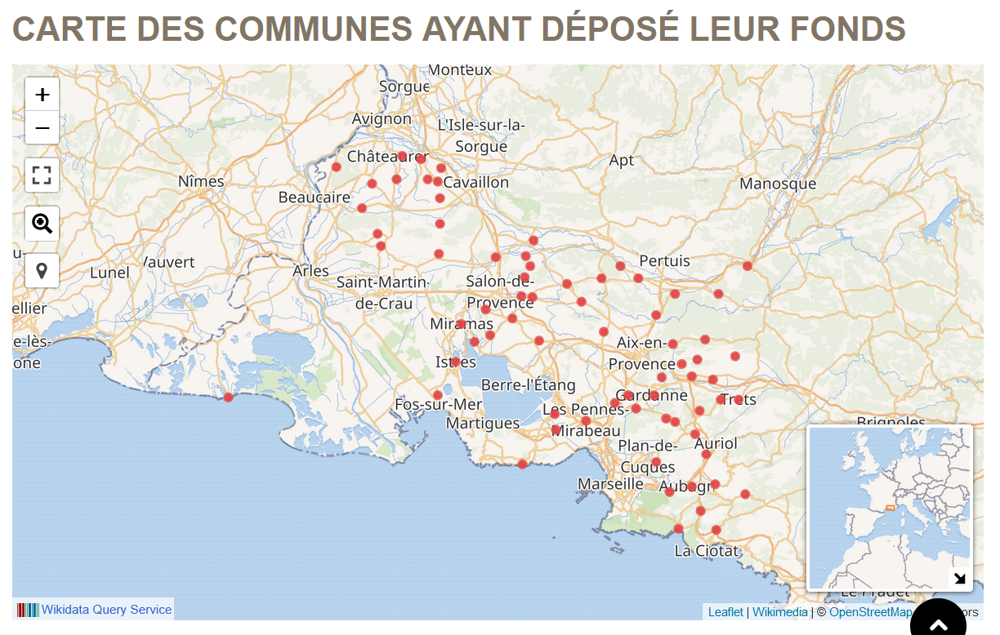

---

class: inverse, center, middle

### Exercice : Créer votre première datavisualisation avec les données de data.culture.gouv.fr

*À partir de l'onglet « Carte » de data.culture.gouv.fr, nous allons
apprendre à créer une carte avec plusieurs jeux de données, ou à ajouter
plusieurs calques et filtres.*

---

### Susciter les .red[usages externes]

.pull-left[

*   Editorialiser les données brutes en proposant des représentations
    visuelles facilitant leur lecture (graphiques, cartographies, etc.),
    par exemple la carte des institutions culturelles partenaires du
    site Histoire des Arts, les tendances clés sur la fréquentation des
    musées.]
    
.pull-right[

* Exemple de la [Région Centre](https://data.centrevaldeloire.fr/pages/patrimoine-architectural/) sur sa plateforme open data 
]    
    
---

### Organiser des .red[évènements]

.pull-left[

* Communiquer pour promouvoir et faire connaître les données ouvertes auprès des communautés des utilisateurs et réutilisateurs potentiels lors d'événéments (rencontre, hackathon, concours, appel à projets,etc.).]

.pull-right[

* Hackathon des [Archives Nationales](https://www.archives-nationales.culture.gouv.fr/resultats-du-hackathon-des-archives-nationales)

* Hackathon de la BNF, 3 éditions depuis 2016. Un [exemple](https://gallica.bnf.fr/blog/21032018/gallicarte-arrive-dans-gallica?mode=desktop) de production
]

---

### Susciter les réutilisations avec .red[un programme de partenariats]

Exemple : **impliquer une école de graphisme à réaliser des
visualisations**

-   Analyse de la [représentation du
    genre](https://churc.github.io/MajorStudio1/) dans la collection
    d'art moderne et contemporain du Met
-   Une [analyse de la forme des œuvres d'art au Met's Costume
    Institute](https://3milychu.github.io/pages/kmeansfashion.html),
    utilisant l'apprentissage automatique pour découvrir de nouvelles
    relations entre les objets au-delà des métadonnées disponibles.
-   Une évaluation de l'histoire de la collecte au Met et de l'évolution
    des pratiques de collecte au fil de l'histoire du Met

.center[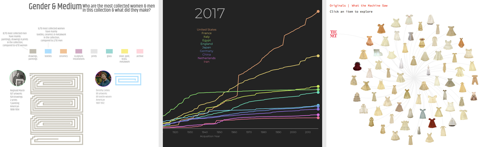]

---

### Château de Versailles et Wikimedia : .red[un partenariat de valorisation de données]

-   1er partenariat entre Wikimedia France et un musée Français
-   Wikipedia est la 2e source d'information des internautes sur
    Versailles après le site internet du château
-   Versailles s'engage dans la voie d'enrichissement de communs
    numérique, à travers les technologies libres et participatives

En février 2011, dans le cadre du partenariat, un wikipédien est venu en
résidence 6 mois à Versailles. Son but était :

-   D'améliorer les contenus de Wikipedia autour de Versailles,
-   D'animer la communauté autour du sujet Versailles.
-   D'expliquer, de rencontrer les équipes de Versailles, de trouver des
    opportunités de collaboration entre conservateurs et wikipediens.

---

### Un bilan positif du partenariat

-   Un enrichissement spectaculaire des contenus : les articles
    concernant le château de Versailles sont passés de 70 à 380
-   Idem pour les photos : plus de 2000 photos versées sur WikiCommons
-   La qualité des articles et des photos a été améliorée
-   Retombées médiatiques importantes

Exemple : le [plafond de la galerie des
batailles](http://commons.wikimedia.org/wiki/File:Schlachtengalerie_Decke.jpg?uselang=fr)
a remporté le concours Wiki Loves Monuments en 2011 (concours photo
mondial visant à valoriser les monuments historiques).

> Au-delà, cela a permis de changer les mentalités en interne :
> Wikipedia est maintenant regardé avec bienveillance par les équipes
> scientifiques du château.

---

### Animer et acculturer une communauté de réutilisateurs

-   Communiquer sur la démarche, mobiliser et interagir avec les
    réutilisateurs (associations, entreprises, acteurs de l'enseignement
    et de la recherche, médias et journalistes, citoyens) pour s'assurer
    que les données ouvertes correspondent à leurs attentes et soient
    effectivement réutilisées et valorisées.
-   Améliorer les données produites, compléter ou produire de nouvelles
    données en s'appuyant sur la contribution et l'engagement citoyen
    (crowdsourcing).

---

### Questions et .red[exercice de groupe]

> -   
>
>     #### Y a-t-il une offre et une demande pour les données publiques ouvertes au sein de votre service, direction ou établissement ? Si oui, qui fournit quoi à qui ?

> -   
>
>     #### D'après vous, quels sont les obstacles principaux pour la publication de données publiques ouvertes au sein de votre service, direction ou établissement ?

---

### Résumé : les .red[facteurs clés de succès] d'une stratégie open data

#### Obtenir un soutien au plus haut niveau

-   Pour mettre en oeuvre les moyens et les ressources à déployer

#### Configurer l'organisation pour l'ouverture

-   Organiser la gouvernance, les circuits de validation

#### Faciliter la découverte et l'utilisation des données

-   Faire attention au référencement, à la qualité des métadonnées

#### Rester à l'écoute et interagir avec les usagers

-   Prévoir des boucles de participation

---

class: inverse, center, middle

# Merci !
