```{r setup, include=FALSE}
library(tufte)
# invalidate cache when the tufte version changes
knitr::opts_chunk$set(cache.extra = packageVersion('tufte'))
options(htmltools.dir.version = FALSE)
```

# Charger un fichier

Charger le fichier, plusieurs format sont acceptés.

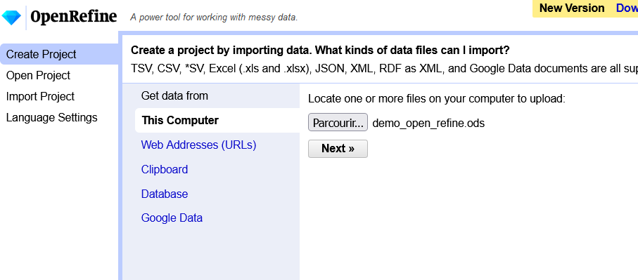

# Sélectionner les options et créer le projet

Suivant les cas : choix du séparateur, de l'encodage, de l'en-tête...puis créer le projet.

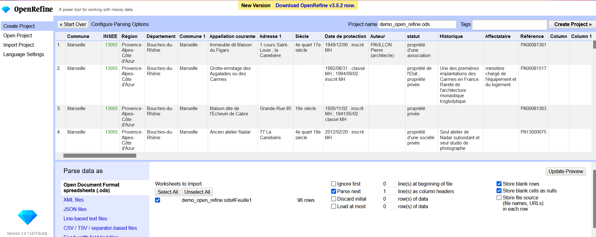

# Les facettes

Le contenu de chaque colonne peut être visualiser sous la forme de facette.
Test sur la facette *Commune* : changer la valeur blank

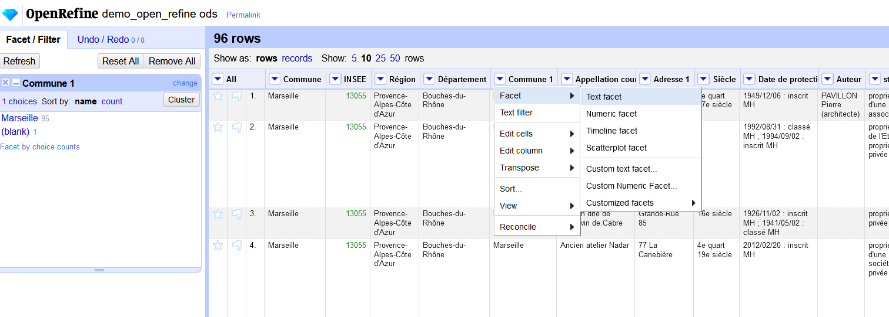

## Changer une valeur

Faire une facette sur *Affectataire* : changer la Direction Générale du Patrimoine en Ministère de la Culture

**Méthode 1** : en modifiant la valeur dans la fenêtre des facettes (*edit*)


**Méthode 2** : en sélectionnant la colonne, *edit cells* et *replace*, permet de faire le changement grâce à un chercher-remplacer

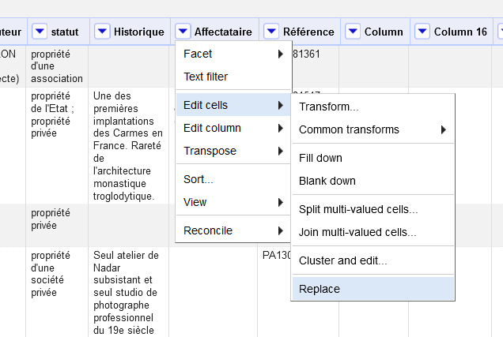

**Méthode 3** : par une expression régulière, *edit cells*, *transform* puis saisir 
> value.replace("direction générale des patrimoines","Ministère de la Culture")

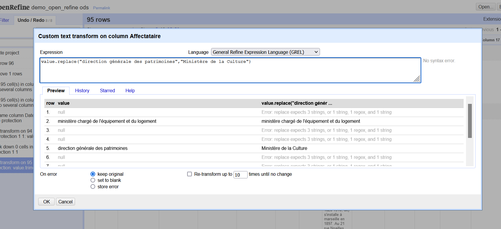

**Méthode 4** : par du rapprochement sémantique. Pour cela il faut choisir une autre colonne, par exemple *commune*


## Séparer des colonnes

Choisir la colonne *Date de protection*, *split into several columns* et choisir les paramètres. Ne garder que la date dans la colonne.

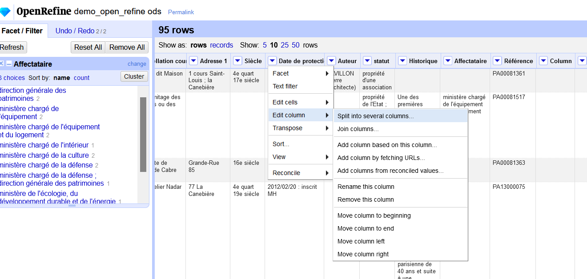

## Autres changements

### Changer le type de champ

La colonne date peut être transformer en une véritable colonne de date : choisir la colonne, *edit cells*, *commons transforms*, *to date*

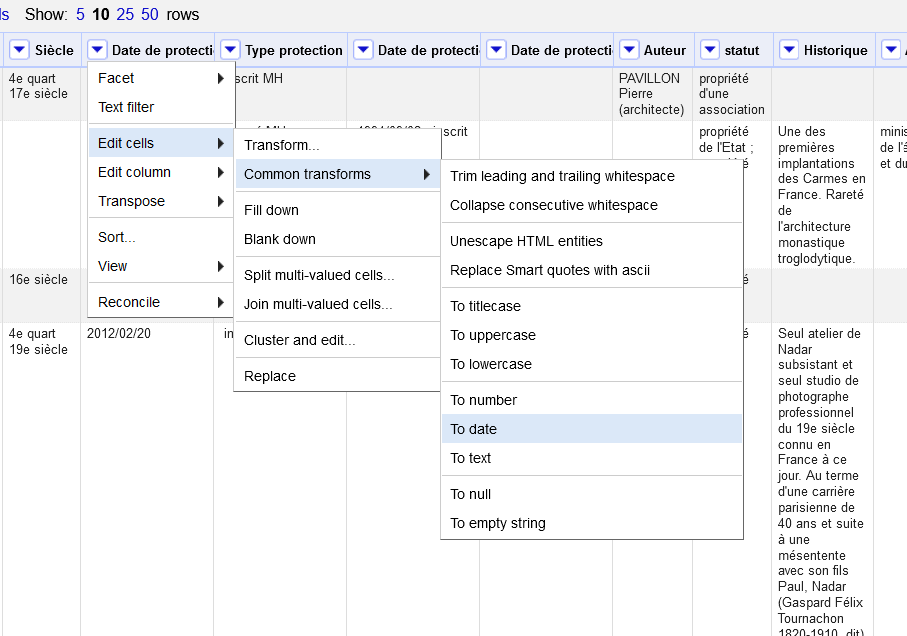

## Supprimer des espaces

Lors des changements précédents des espaces sont apparus en tête de champ, ils peuvent être supprimés : *edit cells*, *Trim leading and trailing whitespace* 

# Aller plus loin avec Open Refine

Open Refine peut appeler l'API de Wikidata, la base de données en web sémantique de Wikimédia. Il est ainsi possible de récupérer des éléments de Wikidata.

Par exemple, notre fichier comprend, pour certains monuments, un auteur. Si ces auteurs existent sur Wikidata, il est possible de rapatrier des informations, par exemple leur lieu de naissance.

Cette opération s'appelle une *réconciliation* de données.

## Réconciliation des auteurs

Choisir la colone puis *reconcile*, *start reconciling* ajouter le service de réconciliation français

> https://wikidata.reconci.link/fr/api

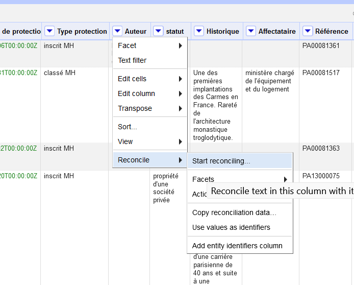
La réconciliation porte sur des être humains, *start reconciling*

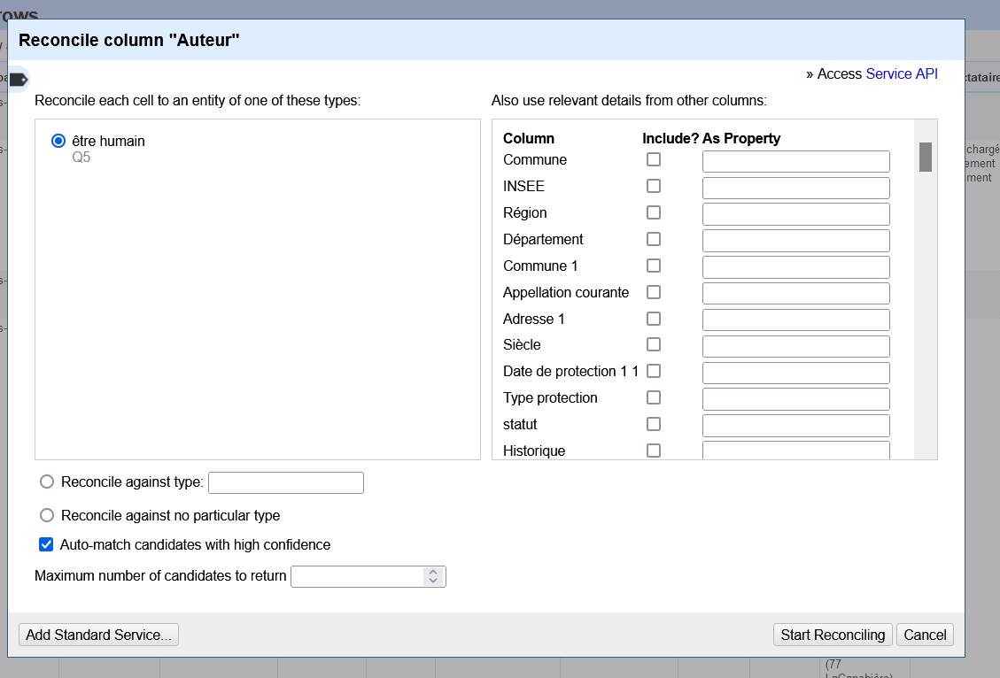
Le système à fait le lien entre notre fichier et Wikidata, il propose une correspondance (matching), si cela correspond bien il faut le valider.

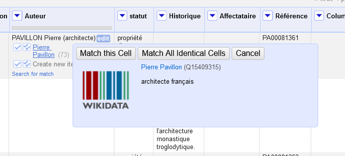
Alors ?

La qualité de la colonne ne permet pas de faire une bonne réconciliation.

## Réconciliation à partir d'un identifiant

Tentons la réconciliation sur une autre colonne : *Référence*. Wikidata intègre de nombreux référentiel dont celui sur les identifiants des monuments historiques. 

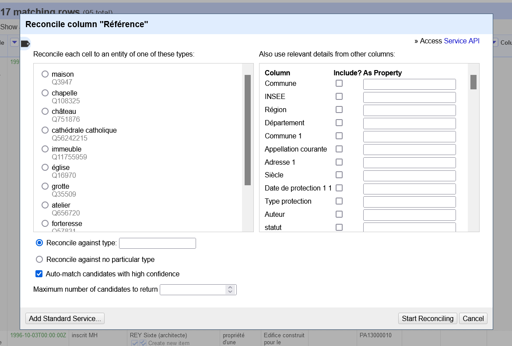

Cette fois cela fonctionne mieux, on peut ensuite récupérer les coordonnées géographiques des monuments, *add columns*, *add columns from reconcilied values*

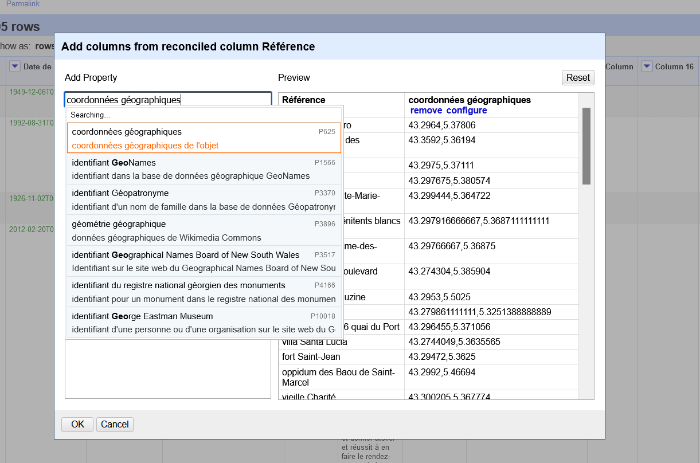