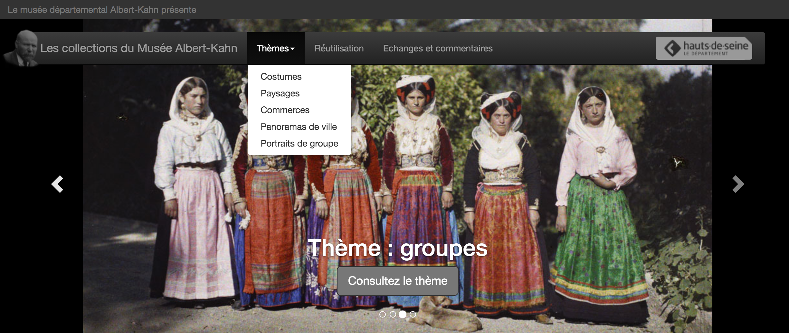
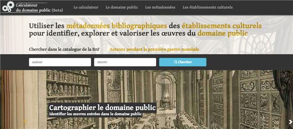
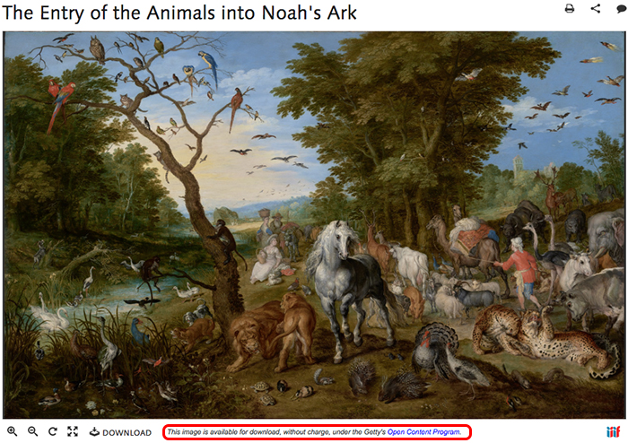
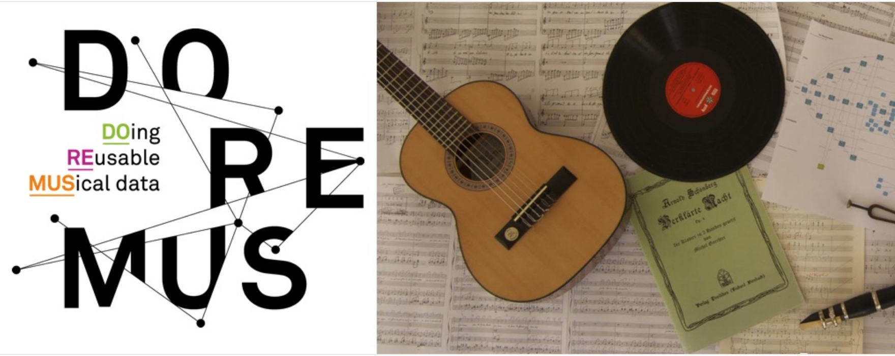
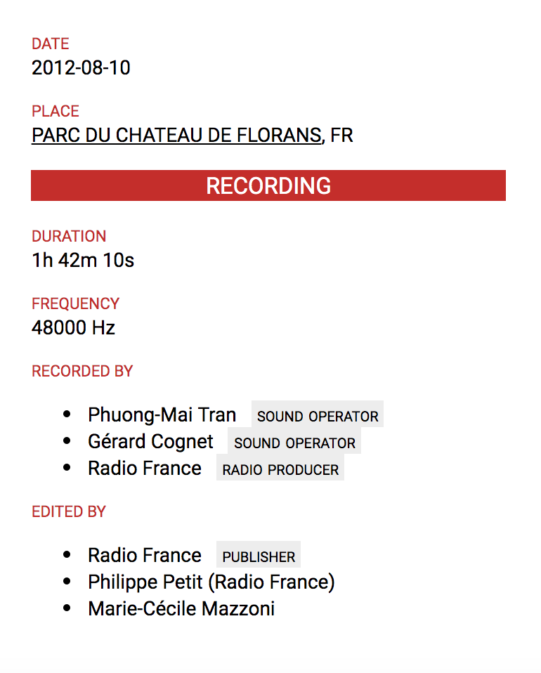
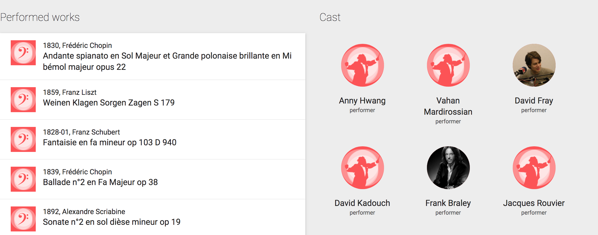
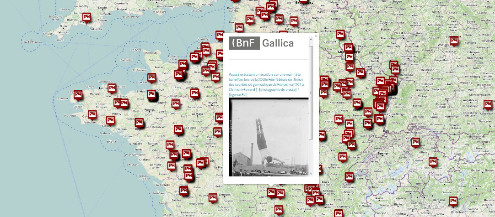
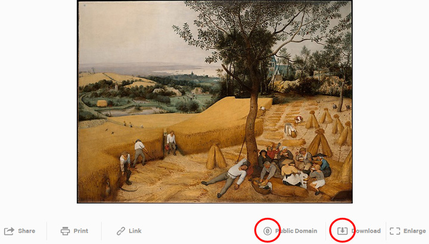
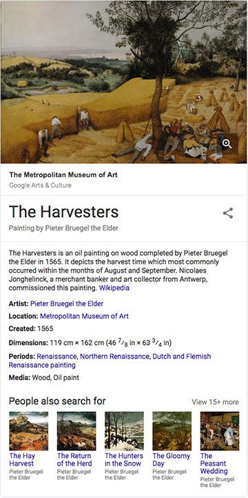
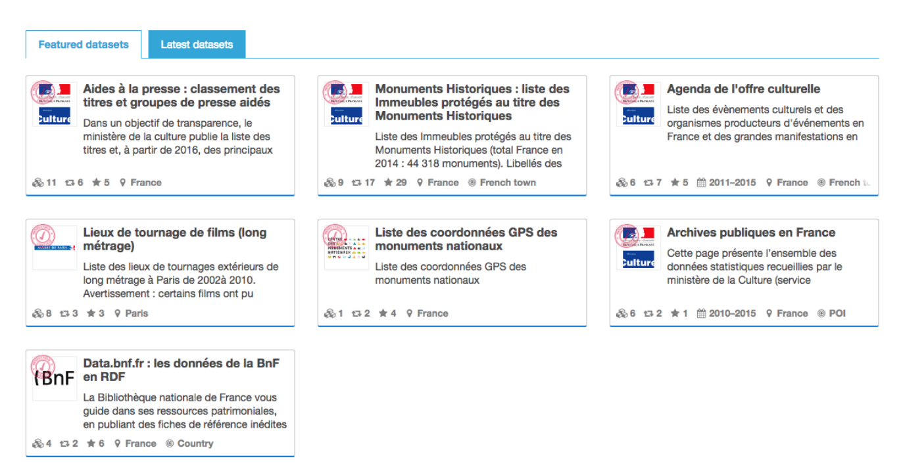

layout: true


`r paste0("<div class='my-footer'><span>", params$event, "</span> <center><div class=logo></center></span></div>")` 


---

class: center, middle

Ces slides en ligne : `r paste0("http://datactivist.coop/", params$slug)`

Sources : `r paste0("https://github.com/datactivist/", params$slug)`


Les productions de Datactivist sont librement réutilisables selon les termes de la licence [Creative Commons 4.0 BY-SA](https://creativecommons.org/licenses/by-sa/4.0/legalcode.fr).

<BR>
<BR>

.reduite[]

---
### Rappel des objectifs de la formation 

#### .red[Jour 1] - Open Data : comprendre les enjeux de l'ouverture des données publiques culturelles
> * Appréhender le contexte et les opportunités d’une politique Open Data dans la culture.

> * Découvrir des cas pratiques appliqués aux données culturelles.

> * Comprendre les problématiques liées aux données du secteur culturel

#### .red[Jour 2] - Open Data : l'ouverture des données publiques culturelles en pratique

> * Connaitre comment mettre en oeuvre l'open data dans le secteur culturel

> * Appréhender les outils et les bonnes pratiques pour la mise à disposition des données et leur réutilisation. 

---
### Programme de la formation 

#### .red[Jour 1] - Open Data : comprendre les enjeux de l'ouverture des données publiques culturelles

* Origines historiques de l’ouverture des données 
* Les grands principes de l’ouverture des données 
* Enjeux de l'ouverture des données
* Cadre juridique de l’ouverture des données culturelles
* Gouvernement ouvert et Etat plateforme : l’ouverture des données dans la modernisation de l’Etat 
* Plusieurs cas d'étude de l’open data culturel 
* La conception d’une stratégie d’open data : principaux leviers politiques, organisationnels, économiques 

---

class: inverse, center, middle

# 1 - Au fait, c'est quoi une donnée ?

---
### Introduction 

#### Ecoutez [l'interview de Serge Abiteboul, commissaire scientifique de l’exposition Terradata et directeur de recherche à l’Inria](https://www.youtube.com/watch?v=qqvsiTUJy7k)

.center[
<iframe width="560" height="315" src="https://www.youtube.com/embed/qqvsiTUJy7k" frameborder="0" allow="accelerometer; autoplay; encrypted-media; gyroscope; picture-in-picture" allowfullscreen></iframe>
]

.footnote[Source : Abiteboul & Peugeot (2017). *Terra Data : qu'allons nous faire des données numériques ?*, Paris : Le Pommier.]

---
### Les données sont partout !


.footnote[source : [The Economist](https://www.emc.com/collateral/analyst-reports/ar-the-economist-data-data-everywhere.pdf)]
 
 
---

### Une définition des données

.pull-left[]
 
.pull-right[
 
> ##### *Les données sont couramment comprises comme les matériaux bruts produits dans l’abstraction du monde en catégories, mesures et toute autre forme de représentation-nombres, caractères, symboles, images, sons, ondes électromagnétiques, bits qui constituent les fondations sur lesquelles l’information et le savoir sont créés.*

- Enregistrabilité

- Briques de base "*buildings blocks*")]

---

### La pyramide Data-Information-Knowledge-Wisdom

.pull-left[
[](https://commons.wikimedia.org/w/index.php?curid=37705247)
]
.pull-right[
Attribuée à [Russell Ackoff](http://en.wikipedia.org/wiki/Russell_L._Ackoff) en 1989, elle signfie que :


- Les **.red[données]** sont la matière "brute" de l'information conçues plutôt pour des machines.
- **.red[L'information]** pourrait être définie comme des données qui ont été interprétées pour dégager du sens pour des humains.
- En donnant du sens à de l'information, on obtient de la **.red[connaissance]**
- En donnant du sens à la connaissance on obtient de la **.red[sagesse]**.
] 
---

### Les données, c'est aussi tout ce qui circule dans un ordinateur

Les données ne sont pas seulement le fondement du savoir, elles sont aussi la base de l'informatique. Tout ce qui circule dans un ordinateur, ce sont des données.

.pull-left[]
.pull-right[
Pensez à votre abonnement téléphonique, chaque mois, vous payez pour consommer un certain volume de données quantifié en octet ou en bit. 

Le volume des données créées et traitées ne cesse de croitre en même temps que les capacités de calcul des ordinateurs. 
]

---

class:middle,center
### Exercice : Identifiez autour de vous 3 appareils qui collectent des données 

---
class:inverse,middle,center

# 2 - Origines historiques de l'open data

---
### Open data : un terme récent

Le terme est apparu pour la première fois dans les années 1970 dans les accords qu’a signés la NASA avec des pays partenaires en vue du partage de données satellitaires. 

C’est en 1995 qu’on en voit le premier usage public aux Etats-Unis dans un rapport de la National Academy of Science intitutlé "_On the Full and Open Exchange of Scientific Data_". Dans le langage courant, cela fait .red[**près de 10 ans**] que l'ouverture des données est devenue un élément majeur des politiques publiques numériques. 

---

### Que signifie “Open” dans un contexte culturel ?

* **L’Open Content** (les contenus ouverts) est la mise à disposition gratuite sur Internet des reproductions numériques des œuvres sous une licence garantissant leur libre accès et leur réutilisation par tous, sans restriction technique, juridique ou financière.

* **L’Open Access** (le libre accès) est la mise à disposition en ligne de contenus numériques, soit sous licences libres (Creative commons, etc.), soit sous un des régimes de propriété intellectuelle. L’Open Access est principalement utilisé pour les articles de revues de recherche universitaires.

* **L’Open Knowledge** (la culture libre) est un mouvement social qui promeut la liberté de distribuer et de modifier des œuvres de l’esprit sous la forme d’œuvres libres. Il puise sa philosophie dans celle du logiciel libre en l’appliquant à la culture et à l’information.

* **L’Open Data** (les données ouvertes), est la mise à disposition gratuite sur Internet des données (comme les métadonnées qui accompagnent une image par exemple).

---
class: inverse, center, middle

## L'open data s'inscrit dans une série de continuités historiques qui en font un **mouvement aux multiples facettes…**

---
### [.red[Facette n°1 :]](https://books.openedition.org/cdf/5005?lang=fr) la transparence

Aller au-delà du droit d'accès et de la réédition des comptes (_accountability_) : réduire les asymétries d'information en accédant au matériau brut de l'information et du savoir

.reduite[

]

---
### [.red[Facette n°2 :]](https://books.openedition.org/cdf/5005?lang=fr) la libre circulation de l’information

Dans la lignée de la cybernétique et du logiciel libre, la circulation des données comme valeur essentielle

.center[]

---

###  [.red[Facette n°3 :]](https://books.openedition.org/cdf/5005?lang=fr) la demande de données brutes

Dans la lignée des premières initatives de partage de données scientifiques en génétique ou en astronomie, obtenir les données sous leur forme pré-interprétative pour refaire les calculs

.center[]

---

### [.red[Facette n°4 :]](https://books.openedition.org/cdf/5005?lang=fr) l'industrie de la donnée
Le nouveau pétrole et les promesses démesurées de croissance

.reduite[.center[]]

---

### .red[Facette n°5 :] la modernisation des administrations

Désiloter l'administration et ouvrir l'innovation, collaborer avec la société civile dans l'élaboration et la mise en œuvre des politiques publiques

.center[] 

---
class: center, middle

# Quelques dates jalon dans l'histoire mondiale de l'open data

---
### 2005 : [L'Open Definition](https://opendefinition.org/)

#### Une définition juridique des droits de l'usager d'un savoir ouvert

.reduite[.center[]]


---
### 2007 : [la rencontre de Sebastopol aux États-Unis](https://opengovdata.org/)


**Quoi ?** Une rencontre de l'Open Governement Group à Sebastopol (Californie), siège des éditions O'Reilly

**Pourquoi ?** : Influencer le futur président des Etats Unis pour faire avancer l'open data

**Comment ?** En adoptant une déclaration définissant les grands principes de l'Open Government Data 


.center[]

---
### Des principes techniques sans portée politique

>"Il peut être vrai en un sens qu'un régime devient plus ouvert chaque fois qu'il fournit des données ouvertes supplémentaires, même pour les sujets banals et apolitiques, mais il est facile d'imaginer qu'un régime fermé pourrait divulguer de grandes quantités de données conformes à ces huit exigences [de Sébastopol] **sans pour autant accroître sa responsabilité réelle en tant que gouvernement **. 
> Une diffusion électronique des déclarations de propagande faites par les dirigeants politiques de la Corée du Nord, par exemple, pourrait satisfaire à ces huit exigences et ne pas promouvoir une transparence ou une responsabilité supplémentaires de la part d'un régime notoirement fermé et opaque."
>Yu & Robinson (2012) « [The New Ambiguity of Open Government](https://papers.ssrn.com/sol3/papers.cfm?abstract_id=2012489) » 

---
### 2008 : Tim Berners-Lee ["Raw data now"](https://www.ted.com/talks/tim_berners_lee_on_the_next_web?language=fr)
#### La demande de données brutes sous les projecteurs

.center[.reduite[]]

---
### 2010 : [le modèle en 5 étoiles de Tim Berners-Lee](https://5stardata.info/fr/)

.reduite[.center[]]


### Depuis 2010 : l'ère des classements

**[Le baromètre international de l'Open Data](https://index.okfn.org/place/)** est un classement de référence, tout comme l'Open Data Index de l'Open Knowledge Foundation


---

### 2013 : la [charte du G8 sur l'open data](https://www.modernisation.gouv.fr/sites/default/files/fichiers-attaches/charte-g8-ouverture-donnees-publiques-fr.pdf)

.center[]

---
### 2015 : la [charte internationale de l'open data](https://opendatacharter.net/)

.center[.reduite[]]

---


class: center, middle

## Les origines de l'open data .red[en France]

---

### Les acteurs politiques de l'open data

* **Etalab** : Coordonne la politique d’ouverture et de partage des données publiques 
* **DITP** : Expérimente l’intelligence artificielle dans les administrations avec Etalab et la DINSIC
* **DINSIC** : Soutient la diffusion de la culture numérique (utilisations des données, recours aux méthodes agiles) et la coopération avec la société civile et les écosystèmes innovants (open data, gouvernement ouvert). 
* **Mission Société Numérique de l'Agence du Numérique** : Structure les acteurs de l’accompagnement au numérique (ou médiation numérique) et les stratégies numériques des territoires, dont l'open data fait partie.
* **DIN** (Département de l'innovation numérique au Secrétariat général du Ministère de la Culture) : chargé d’identifier les informations publiques du ministère et de ses établissements culturels produites dans le cadre des missions de service public, de coordonner le recensement, la qualification des informations publiques, et la mise à disposition des données ouvertes qui ont vocation à être librement accessibles et gratuitement réutilisables.

---

### Une politique Open Data pilotée au niveau national

.red[**La mission Etalab** :] est créée en 2011 et rattachée au secrétariat général de la modernisation de l’action publique (SGMAP), placée sous l’autorité du Premier Ministre.

* Coordonne la politique d’ouverture et de partage des données publiques (open data)

* Coordonne les actions des administrations de l’Etat et leur apporte son appui pour faciliter la diffusion et la réutilisation de leurs informations publiques ;

* Développe et anime la plateforme nationale data.gouv.fr 

* Coordonne le Service Public de la Donnée.

* Anime le réseau des coordinateurs Open Data désignés pour chaque ministère.

Source : https://www.etalab.gouv.fr/

---

## Data.gouv.fr ?

Data.gouv est la plateforme nationale ouverte des données publiques françaises.
Elle a été conçue et inaugurée en 2011, par la mission Etalab, puis refondue en 2013.

.center[] 

On y trouve des milliers de jeux de données, provenant principalement de producteurs publics (Ministère de l'intérieur, Agence française de développement, Insee, Ville de Paris, Région Bretagne, CNIL...) mais aussi de producteurs tiers (OpenStreetMap, OpenFoodFacts...)

---
## Au-delà de data.gouv.fr

Data.gouv.fr est la plateforme **nationale** d'open data mais ce n'est pas la seule plateforme publique qui met à disposition des données ouvertes. Il existe :

+ Des plateformes open data gérées par les **collectivités territoriales**. Par exemple, [Paris Data](https://opendata.paris.fr/explore/?sort=modified), [la Région Occitanie](https://data.laregion.fr/pages/accueil/), [l'agglomération de Saint-Malo](https://data.stmalo-agglomeration.fr/page/accueil/)...

+ Des plateformes open data gérées par des **ministères**. Exemple : [data.culture.gouv.fr](https://data.culture.gouv.fr/pages/home/)

+ Des plateformes open data gérées par des **entreprises**. Exemple [DataNova](https://datanova.laposte.fr/page/accueil/) (La Poste)

+ Des jeux de données directement publiés sur le site des producteurs de données, sans plateforme dédiée. Exemple : Insee

---
class: center, middle

## Et au .red[Ministère de la Culture]

---

### Les dates importantes à retenir

.red[**2011**] : Le ministère s'engage dans la politique gouvernementale en faveur de l’ouverture et du partage des données publiques. Les premiers jeux de données sont publiés par le Ministère sur data.gouv.fr

.red[**2013**] : Adoption de la première feuille de route « open data culturel »

.red[**2014**] : La BnF ouvre ses métadonnées descriptives en "Licence Ouverte" (plus de 12 millions de notices bibliographiques, 2,5 millions de notices d'autorité validées)

.red[**2014/2015**] : Publication de la feuille de route «Métadonnées culturelles et transition Web 3.0» et diffusion des guides de référence en matière de transition technologique vers le Web sémantique

.red[**2016**] : Ouverture du portail data.cuture.gouv.fr

.red[**2017**] : Les Archives nationales optent pour l’ouverture et la gratuité des données

.red[**2018**] : Une nouvelle feuille de route stratégique

---

### Un portail : .red[data.culture.gouv.fr]


Le portail des données ouvertes du ministère de la Culture met à disposition les données de l'administration centrale, d'une DRAC ou d'un SCN et moissonne automatiquement ces données sur data.gouv.fr, pour pouvoir les exposer sur les deux plateformes à la fois. 


*Pour toute information sur la mise à disposition de nouveaux jeux de données, contacter le département de l’innovation numérique (SG/SCPCI) via l’onglet « Contact » de la plateforme data.culture.gouv.fr.*

---

### Possibilité d'héberger ses données sur data.gouv .red[pour les établissements publics]

Pour les établissements publics, la mise à disposition des données est à effectuer sur le site .red[data.gouv.fr.]

Afin d’améliorer la visibilité des données culturelles, le ministère référence également les données des établissements sur la plateforme ministérielle data.culture.gouv.fr.

Cela implique la création d’une page dédiée à l'établissement, puis la publication des jeux de données conformément [aux modalités précisées par la DINSIC](https://doc.data.gouv.fr/jeux-de-donnees/publier-un-jeu-de-donnees/)

> **Le ministère mettra en place les mécanismes nécessaires pour que toutes les données publiées de cette façon soient ensuite automatiquement visibles sur data.culture.gouv.fr.**

---

### Les grandes fonctionnalités .red[d’un portail open data]

Un portail open data est un espace de présentation des données publiques ouvertes comprenant idéalement les grandes fonctions suivantes :

* recherche des jeux de données
* présentation détaillées des jeux de données
* accès aux données brutes open data, sous différents formats, y compris API
* présentation graphique des données quand cela est possible
* outils d'extraction ou de transfert des données
* dispositifs éditoriaux pour animer le projet open data

---

class: inverse, center, middle

# 3. Les principaux enjeux de l'open data 

---

### La transparence de la vie publique et la participation citoyenne à l’action publique


* Exemple avec **Le grand débat national**, mars 2019


---

### L’efficacité de l’action publique : amélioration de la qualité des services publics 

* Exemple : .red[sauver des vies en mer] en prévenant les accidents maritimes


---

### Le développement de l’attractivité des territoires

* Le portail .red[*DATAtourisme*]


---

### Le soutien à l’innovation économique et sociale

* Les données des **valeurs foncières** reprises par le site meilleurs agents, avril 2019


---

### Une opportunité en matière de démocratisation culturelle et de transmission des savoirs

* Le projet **UrbanHist** à Toulouse

.center[]

---

class: inverse, center, middle

# 4. Revue des principes d'ouverture des données 

.footnote[D'après les "eight principles of open government data" définis les 7-8 décembre 2007 à Sébastopol. Source: [opengovdata.org](https://opengovdata.org/)]

---
class: center, middle

### 1. Des données .red[complètes]

> **Toutes les données publiques doivent être rendues disponibles dans les limites légales liées à la vie privée ou la sécurité**

C'est le **principe d'open data par défaut** que nous aborderons en détail à la suite. 
---
class: center, middle

### 2. Des données .red[primaires]

> **Les données ouvertes sont telles que collectées à la source, non-agrégées avec le plus haut niveau de granularité**

---
### .red[Trouver] des données granulaires

.pull-left[

Le portail Data Culture basé sur la solution OpenDataSoft permet de trouver rapidement les données plus granulaires en triant les données par le nombre d'enregistrements dans le catalogue de données. 

]


.pull-right[
On trouvera ainsi facilement la [base Joconde](https://data.culture.gouv.fr/explore/dataset/base-joconde-extrait/information/) qui décrit les oeuvres des musées de France et contient environ 600 000 notices.


]

---
class: center, middle

### 3. Des données .red[fraiches] (*timely*)

> **Les données doivent être disponibles dès qu'elles sont produites**

---
### .red[Un exemple de] données temps réel

La ville d'Issy les Moulineaux ouvre les [données temps réel de l'affluence](https://data.issy.com/explore/dataset/affluences-temps-reel/map/?sort=open&refine.secondary_name=M%C3%A9diath%C3%A8que+d%27Issy-les-Moulineaux&location=15,48.83064,2.26653&basemap=mapbox.streets) dans ses structures dont la médiathèque. Ces données sont exploitées notamment par l'application [Affluences](https://www.affluences.com/).

.reduite[
.center[

]
]

---
class: center, middle

### 4. Des données .red[accessibles] 

> **Les données doivent être utilisables par le plus grand nombre d’usagers potentiels**

---

### Exemple les Archives de la Planète .red[du musée Albert Kahn]

> **La réutilisation commerciale des images est interdite**

* La collection d'autochromes d'Albert Kahn de 72 000 photographies en couleur sur plaques de verre prises entre 1909 et 1931 dans plus de 50 pays, 

.center[]

http://collections.albert-kahn.hauts-de-seine.fr/


---
class: center, middle

### 5. Des données .red[exploitables par les machines] 

> **Les données peuvent être traitées automatiquement par les machines** 

---
### .red[Exemple :] le nombre de flashs par radars en France

.pull-left[
Le ministère de l'Intérieur publie les statistiques du nombre de flashs sur les radars en France mais sous la forme de fichiers PDF. Ces tableaux de données sont inexploitables par les machines, on ne peut pas les importer simplement dans un outil d'analyse de données. 


]
.pull-right[
A la suite d'une conversation sur [TeamOpenData](), un citoyen a extrait ces données avec l'outil [Tabula](tabula.technology) et les a republié sur data.gouv.fr dans un format lisible par les machines. Plusieurs cartes ont été produites à la suite. 


]


---
class: center, middle

### 6. Des données .red[non discriminatoires]

> **Elles peuvent être utilisées par tous sans réclamer un enregistrement préalable**

.pull-left[ 

Pour consulter ou télécharger les données du portail DataTourisme, il faut s'inscrire sur le site et créer un compte obligatoire.


]

.pull-right[

Suite au signalement de cette obligation et à une discussion sur TeamOpenData, ces données ont finalement été rendues accessibles à tous sur le portail Data.gouv.fr


]


---
class: center, middle

### 7. Des données publiées .red[dans un format ouvert]

> **Ce format ne doit pas être la propriété d'une organisation en particulier (.xls) et doit être gouverné par ses usagers**

---

### Exemples courants de fichiers excels publiés

.pull-left[

A éviter : police ou colonnes en couleur pour signifier une légende particulière pour les données.


]

.pull-right[

#### Ce fichier de la fréquentation des musées en France a depuis été mis à jour sur Data-Culture et Data-Gouv

]

---

class: middle

### 8. Des données publiées .red[sous une licence ouverte]

#### Dans le domaine de la culture, la licence libre fait référence à 4 libertés fondamentales :

* la possibilité d'utiliser l'œuvre, pour tous les usages ; 
* la possibilité d'étudier l'œuvre ; 
* la possibilité de redistribuer des copies de l'œuvre ; 
* la possibilité de modifier l'œuvre et de publier ses modifications.

Ces droits s'entendent y compris pour des utilisations commerciales. 

> Il faut distinguer la diffusion (notion d'accès) de la réutilisation (notion d'exploitation).

---

### Les musées départementaux .red[de la Haute-Saône]

> Afin de donner de la visibilité à la collection des musées départementaux, et à travers elle à la collectivité détentrice de cette collection, d'envisager l'enrichissement de cette collection et des données associées via cette mise en ligne et de diffuser de la culture, **le réseau de musées a réalisé un partenariat avec l’encyclopédie Wikipédia**, pour diffuser des donnés sous licence libre. 

.pull-left[
*Le château de Champlitte, qui abrite le musée départemental d'Arts et Traditions populaires.*
Crédits	© Musée départemental d’Arts et Traditions populaires
]

.pull-right[

]

---
class: inverse, center, middle

# 3. Éléments du cadre juridique et historique de l'open data

---

### Un appareil législatif étoffé


1. **Loi CADA**, dite Loi Informatique et Libertés du 6 janvier 1978.

1. **Création de la CADA** (Commission d'Accès aux Documents Administratifs)

1. **Création de la CNIL** (Commission Nationale Informatique et Libertés)

1. **Directive INSPIRE** de 2007

1. **Directive PSI** de 2013

1. **Loi Valter** de 2015

1. **Loi pour une République Numérique** (loi Lemaire) du 7 octobre 2016.

---

### Frise chronologique de l'évolution du .red[cadre législatif] en France

```{r echo=FALSE}
library(timevis)
data <- data.frame(
  id      = 1:7,
  content = c("Loi CADA","Directive PSI", "Directive INSPIRE", "Révision de la directive PSI", "Loi Notre", "Loi Valter", "Loi pour une République Numérique"),
  start   = c("1978-07-17","2003-11-17", "2007-03-14","2013-06-13","2015-08-07","2015-12-28","2016-10-07")
)
timevis(data, loadDependencies = FALSE, width = "715px", height = "350px")
```

---

### 1978 : La loi CADA, vers le "droit de savoir"
* Le fondement : la .red[Déclaration des Droits de l'Homme et du Citoyen de 1789] dans son article 15, "la Société a le droit de demander compte à tout Agent public de son administration." 

* Le droit d'accès des citoyens à l'information publique émerge en **1978 avec la loi dite CADA** du nom de la Commission d'Accès aux Documents Administratifs. 

* La France était le .red[3e pays au monde] après la Suède en 1766 et les Etats-Unis en 1966 avec le Freedom of Information Act (FOIA) en 1966  à accorder un "droit de savoir" avec pour but d'améliorer les relations entre le public et l'administration.

.footnote[Il faudrait maintenant désigner la loi comme le Code des relations entre le public et l'administration (CRPA) qui, dans son [livre 3](https://www.legifrance.gouv.fr/affichCode.do;jsessionid=BDF8EC0BD562E214CCD9A5ADD435D690.tplgfr42s_1?idSectionTA=LEGISCTA000031367685&cidTexte=LEGITEXT000031366350&dateTexte=20190429), codifie le droit d'accès et de réutilisation mais il est encore moins connu que la loi CADA…]

---

### Le guide CADA-CNIL : le document de référence

Ce guide constitue une bonne source de référence. Nous avons publié sa [fiche de lecture](https://teamopendata.org/t/guide-commun-cnil-et-cada-open-data-rgpd/1320) sur la plateforme TeamOpenData.

.center[]

[Source : Guide Open Data Cnil](https://www.cnil.fr/sites/default/files/atoms/files/guide_open_data.pdf)

---

### La loi CADA : quelques imperfections

Même si la France est le 3e pays à avoir adopté un droit d'accès, la loi CADA n'est pas un outil fort de la transparence de la vie publique. Ses principaux défauts : l'absence de sanctions et une procédure longue qui décourage les demandeurs d'information et de données.
[](http://europam.eu/?module=country-profile&country=France)

---

### Un droit d'accès très faible au regard des standards internationaux

.pull-left[Paradoxe : la France a une législation parmi les plus ambitieuses au monde en matière d'open data mais le droit d'accès y est un des plus mauvais au monde… 

La France est classée .red[105e sur 123] du classement mondial des lois d'accès à l'information publique RTI Rating.
[www.rti-rating.org](https://www.rti-rating.org/country-data/)

L'open data est comme la Tour de Pise : un très bel édifice posé sur des fondations instables.
]

.pull-right[

] 


---
class: center, middle

## 3.a Que dit la Loi pour une république numérique ?

---
### La loi est promulguée le 7 oct. 2016

Elle a pour objectifs de : 
* Encourager l’innovation et l’économie numérique
* Promouvoir une société numérique protectrice 
* Garantir l’accès de tous au numérique (Haut débit..)

Source : 
http://www.vie-publique.fr/actualite/dossier/loi-internet/republique-numerique-que-change-loi-du-7-octobre-2016.html

---

### Premier principe : l'ouverture des données par défaut

> Les administrations  devront publier en ligne dans un standard ouvert leurs principaux documents, y compris leurs codes sources, ainsi que leurs bases de données qui présentent un intérêt économique, social, sanitaire ou environnemental. 


Cette obligation concerne les *administrations d’Etat*, les *collectivités* locales de *plus de 3 500 habitants*, les établissements publics et les organismes privés chargés d’un service public.


---
### Le périmètre de l'open data par défaut 

L'ouverture concerne un .red[**périmètre très large**] : 
* les documents communiqués suite à des demandes CADA
* les "bases de données"
* les données "dont la publication présente un intérêt économique, social, sanitaire ou environnemental".
Rares sont donc les données publiques qui ne sont pas concernées par cette obligation d'ouverture. 

---

### La définition des données

Le guide CADA-CNIL rappelle la **définition des "bases de données"**

> On entend par base de données un recueil d'œuvres, de données ou d'autres éléments indépendants, disposés de manière systématique ou méthodique, et individuellement accessibles par des moyens électroniques ou par tout autre moyen (art L112-3 du code de la propriété intellectuelle)

> En d’autres termes il s’agit d’un ensemble de données organisé en vue de son utilisation par des programmes correspondant à des applications distinctes et de manière à faciliter l'évolution indépendante des données et des programmes (en anglais : data base)

Le document donne également une **définition de ce qu'est une "donnée"** :

> Une donnée correspond à la représentation d'une information sous une forme conventionnelle destinée à faciliter son traitement (en anglais : data).

---

### Deuxième principe : création d’un service public de la donnée

→ La loi souhaite faciliter la réutilisation des principales bases de données de l’État par les acteurs privés ou publics (entreprises, associations, chercheurs, etc.), en leur garantissant un niveau élevé de qualité de service.

→ La loi propose de mettre à disposition comme “service public” les grandes bases de données de référence de l’État , comme par exemple le répertoire SIRENE des entreprises ou le cadastre. 


---

### Les 9 jeux de données  du Service Public de la Donnée

* Le répertoire des entreprises et des établissements (base Sirene)
* Le répertoire national des associations (RNA),
* Le plan cadastral informatisé (« Cadastre »),
* Le registre parcellaire graphique (RPG)
* Le référentiel à grande échelle (RGE),
* La base adresse nationale (BAN),
* Le répertoire opérationnel des métiers et des emplois (ROME),
* Le référentiel de l’organisation administrative de l’Etat,
* Le code officiel géographique (COG).

Source : https://www.data.gouv.fr/en/reference

---

### Open data = Licence ouverte + Format ouvert

* **Les données sont publiées dans un format ouvert** : Ce format ne doit pas être la propriété d'une organisation en particulier comme Excel ou PDF (Microsoft) 
* **Les données sont publiées dans une licence ouverte** : Idéalement dans le domaine public sinon dans une licence conforme à l'Open Definition : Licence Ouverte (CC-BY) ou ODBL (CC-BY-SA)
* **Les données sont exploitables par les machines** : Les données peuvent être traitées automatiquement par les machines
* **Les données sont non discriminatoires** : Elles peuvent être utilisées par tous sans réclamer un enregistrement préalable sur le site qui les publie
* **Des données primaires** : Les données ouvertes sont telles que collectées à la source, non-agrégées avec le plus haut niveau de granularité

Contre exemple : https://www.data.gouv.fr/fr/datasets/comptage-voyageur-sur-rer/ 


---
### Loi pour une République numérique : une limitation des licences

La loi **limite par décret les licences** qui peuvent être utilisées par les administrations. Le [décret du 27 avril 2017](https://www.legifrance.gouv.fr/eli/decret/2017/4/27/2017-638/jo/texte) autorise deux licences : 

* la Licence Ouverte d'Etalab 

* la licence ODbL (Open Database License).

Ces deux licences offrent **un choix aux administrations** : la licence ouverte étant plus permissive que la licence ODBL qui a été conçue dans une logique de "pot commun" permettant de garantir que les données resteront ouvertes après leur réutilisation.

Utiliser une autre licence impose une **homologation** auprès de la DINSIC avec un exposé des motifs ayant conduit à sortir de la liste fixée dans le décret et une consultation des usagers affectés par la licence proposée. L'homologation doit être faite pour chaque jeu de données même si la licence reste la même.

---

### Zoom sur les licences


---

### Open Content et contenus sous .red[licences Creative Commons]

**Les œuvres placées sous licences Creative Commons ne sont pas pour autant libres de droit, ni gratuites.** Le titulaire des droits détermine les conditions précises dans lesquelles l’œuvre peut être partagée et réutilisée.  

* **CC-BY (By Yourself : par vous-même)** : le réutilisateur doit “créditer l’œuvre, intégrer un lien vers la licence et indiquer si des modifications ont été effectuées à l’œuvre”. En doit français, l’option correspond approximativement au droit de paternité.

* **CC-BY-SA (Share Alike : partage à l’identique)** : le réutilisateur doit créditer l’œuvre et utiliser la même licence pour toutes les œuvres dérivées. Il s’agit d’une licence “contaminante” ou “virale”, analogue au copyleft.

* **CC-BY-NC (Non Commercial)** : le réutilisateur doit créditer l’œuvre et ne pas en faire un “usage commercial”. La définition de “commercial” reste floue en pratique, faute d’accord au sein de la communauté.

---

### Les licences (suite)

* **CC-BY-ND (Non Derivative : non-dérivé)** : le réutilisateur doit créditer l’œuvre et ne peut diffuser d’altérations (modifications, transformations).

* **CC-BY-NC-SA (Non Commercial / Share Alike)** : le réutilisateur doit créditer l’œuvre et ne pas en faire un “usage commercial”. Ces restrictions affectent toutes les œuvres dérivées - à la manière du copyleft.


* **CC-BY-NC-ND (Non Commercial / Non Derivative)** : le réutilisateur doit créditer l’œuvre ; il ne peut ni en faire un usage commercial ni publier des créations dérivées.

* **CC0 (domaine public)** : les restrictions sont levées autant que la législation existante le permet afin de construire une forme de placement volontaire et anticipé dans le domaine public. Ainsi, dans les pays où le droit moral est mal établi, ces licences permettent de lever l’obligation d’attribution de la paternité de l’œuvre à un auteur.

> .red[**Seuls les contenus mis à disposition sous licence CC0 ou Public Domain peuvent être considérés comme ouverts dans le sens de la culture libre**]


---
### Le cas des données personnelles

La prohibition de la communication à des tiers ne porte pas sur les données personnelles en général, mais .red[**sur les données à caractère personnel relevant de la vie privée**] des personnes concernées (âge, coordonnées personnelles, situation patrimoniale et financière, sympathies politiques, les croyances religieuses…)

La mise en ligne de données à caractère personnel sans anonymisation n'est permise que dans .red[**trois cas**] :
1. une disposition législative contraire le prévoit (exemple : [Transparence Santé](https://www.data.gouv.fr/fr/datasets/transparence-sante-1/))
2. si les personnes intéressées ont donné leur accord (consentement au sens de l’article 4 du RGPD)
3. les documents relevant de [l’article D312-3-1 du CRPA](https://www.legifrance.gouv.fr/affichTexte.do;jsessionid=51E99AF738C12521572D6A7F6C8C03E8.tplgfr23s_1?cidTexte=JORFTEXT000037797147&dateTexte=&oldAction=rechJO&categorieLien=id&idJO=JORFCONT000037796937)


Hors de ces cas, il faut .red[**[anonymiser les données](https://github.com/SGMAP-AGD/anonymisation/wiki/Guide-de-l'anonymisation)**] : elles ne doivent plus se référer à une personne réelle (exit les noms, identifiants…) et ne doivent plus être spécifiques à un individu mais communes à un ensemble de personnes. L’indexation de ces données par un moteur de recherche externe est proscrite.

---

### Zoom sur le régime de la réutilisation des données et .red[le régime dérogatoire pour le secteur culturel]

Le code des relations entre le public et l'administration (CRPA) pose le .red[principe de la gratuité de la réutilisation]. **La tarification est l’exception et n’est autorisée que dans deux cas** : 

* Lorsque les administrations sont tenues de couvrir par des recettes propres une part substantielle des coûts liés à l’accomplissement de leurs missions de service public (25 % minimum). Cette disposition ne concerne aucun établissement culturel. 

* Lorsque la réutilisation porte sur « des informations issues des opérations de numérisation des fonds et des collections des bibliothèques, y compris des bibliothèques universitaires, des musées et des archives et, le cas échéant, sur des informations qui y sont associées lorsque ces dernières sont commercialisées conjointement ». 

> Les données publiques nativement numériques ne peuvent pas faire l'objet d'une redevance.

---

### Réutiliser des informations publiques dans le domaine de la culture

> La réutilisation d'informations publiques ne peut faire l'objet d'un droit d'exclusivité accordé à un tiers, sauf si un tel droit est nécessaire à l'exercice d'une mission de service public. Lorsqu'un tel droit est accordé, la période d'exclusivité ne peut dépasser dix ans. 

**Lorsqu'un droit d'exclusivité est accordé pour "les besoins de la numérisation de ressources culturelles", la période d'exclusivité peut être supérieure à dix ans sans dépasser quinze ans.** 

L'application d’une redevance est un recours permis par la loi, pas une obligation : 

> En juillet 2017, les Archives nationales se sont engagées dans l’Open data en consacrant le principe de gratuité pour toute réutilisation aux ressources libres de droits qu’elles conservent.

---

### Les données .red[à exclure du périmètre de l'Open data]

L'open data par défaut ne concerne pas toutes les données, il existe quelques exceptions : 


> * Les données couvertes par un secret protégé par le CRPA
> * Les informations sur laquelle des tiers détiennent des droits de propriété intellectuelle
> * Les informations contenant des données à caractère personnel ou pouvant affecter la vie privée des citoyens

---

#### Les données couvertes par un secret protégé par le CRPA

Un document ne peut être communiqué que sous réserve des secrets couverts au titre des dispositions du CRPA. De même un document ne peut être publié qu'après avoir fait l'objet d'un traitement permettant d'occulter les mentions protégées.

#### Les informations sur laquelle des tiers détiennent des droits de propriété intellectuelle

Pour déterminer s'il existe des droits d'auteur sur un contenu culturel, vous pouvez consulter le guide publié par le ministère de la Culture "Guide ouverture et réutilisation des informations publiques numériques du secteur culturel", chapitre II « Principes fondamentaux de la propriété littéraire et artistique communs à l’ensemble des champs culturels ».

---

### Projet : Le calculateur du domaine public pour identifier les oeuvres libres de partage



---
class: inverse, center, middle

# 4 État-Plateforme et Open Gov

---

### Gouvernement Ouvert et Open Data

Rappel : l'open data n'est pas qu'une pratique d'ouverture et de publication de données, c'est également un **mouvement et une philosophie relatif à un meilleur accès à  l'information publique**.

Plus largement, l'open data s'inscrit dans le mouvement du **gouvernement ouvert**, aussi appelé **OpenGov** en anglais. Celui-ci promeut :

+ La plus grande .red[**transparence de l'information**] (notamment à travers l'open data), pour permettre entre autre le suivi des politiques publiques

+ Une plus forte .red[**participation des citoyens**] dans l'élaboration des politiques publiques : à la fois en étant davantage consulté mais aussi en étant acteur dans la construction de celles-ci

+ Une plus forte .red[**collaboration**] au sein des administrations publiques (casser les silos) et à l'extérieur (travailler avec des acteurs associatifs, privés) pour concevoir et mettre en oeuvre les politiques publiques

---
## Gouvernement Ouvert

Ce schéma, réalisé par l'association [DémocratieOuverte](https://democratieouverte.org/), résume bien les différents enjeux autour du gouvernement ouvert :

.center[] 


---
### OGP/PGO : Partenariat pour un Gouvernement Ouvert

.center[]

En septembre 2011, un partenariat multilatéral s'est créé afin de promouvoir le gouvernement ouvert et traduire ses valeurs en des actions gouvernementales concrètes : **le partenariat pour un gouvernement ouvert** (PGO), aussi appelé **Open Government Partnership** (OGP)

Initialement fondé par 8 pays (Brésil, Indonésie, Mexique, Norvège, Philippines, Afrique du Sud, Royaume-Uni et États-Unis), le PGO en compte désormais 70, dont la France

---
### OGP/PGO : Partenariat pour un Gouvernement Ouvert

Pour rejoindre le partenariat, il faut avoir été "coopté" par des acteurs de la société civile (ex: association type Amnesty International) qui viennent témoigner de la bonne volonté du gouvernement.

Une fois rejoint, les pays doivent rédiger, en concertation avec la société civile, un .red[**plan d'action**] de deux ans dans lequel plusieurs engagements sont inscrits. Ces engagements publics doivent avoir trait à la transparence de l'information, la participation citoyenne et la redevabilité (accountability) de l'action publique.
Par exemple : 
+ Développer un budget participatif représentant X % du budget d'une CT
+ Entamer une démarche open data qui permettent de libérer des données
+ Concerter les citoyens dans le cadre d'un projet de loi...

Ces engagements font ensuite **l'objet de vérifications et d'audit de la part de chercheurs indépendants** (IRM) tant sur la manière dont ils ont été rédigés/conçus que sur leur efficacité et niveau d'avancement réel

---
### Le plan d'action national pour la France

.center[] 

* Le 2è Plan d'action 2018-2020 est en cours
* Il contient 21 engagementsportés par 12 ministères, 2 juridictions ou autorités indépendantes, et plusieurs agences gouvernementales 
* Il intervient dans la continuité des chantiers engagés par le gouvernement français sur la transformation numérique de l’Etat 

.footnote[[Lire le Plan d'action national pour la France 2018-2020](https://www.etalab.gouv.fr/wp-content/uploads/2018/04/PlanOGP-FR-2018-2020-VF-FR.pdf)]

---

class: inverse, center, middle

# 5. Les projets emblématiques de l’open data culturel

---

### Le Getty Museum et .red[l'Open Content]

En 2013, le Getty Museum place les reproductions de 4 600 de ses œuvres sous le régime de l’Open Content. Aujourd’hui, c'est plus de 115 000 œuvres qui sont concernées. 

* Les images, téléchargeables en HD, sont réutilisables pour tout usage, commercial ou pas ; à la différence des textes du site (notamment les notices descriptives)

* Les images et contenus média ne font pas l’objet d’une licence ouverte Creative Commons (CCBY : mention de paternité), mais sont réutilisables sans restriction, dans la limite du copyright qui peut s’y appliquer.


.center[]

---

### Le Palais national .red[de Taiwan]

Entre 2015 et 2017, le Palais national de Taiwan, a ouvert 70 000 images sur une plate-forme dédiée ([National Palace Museum Open Data](https://theme.npm.edu.tw/opendata/?lang=2)), qui permet de télécharger sans restriction des images d’œuvres et des “datasets” de ses expositions. 

Ceci a été réalisé au terme d’un grand projet de numérisation de ses collections et en lien avec la politique de gouvernement ouvert du pays.

.center[]


---

### DoReMus :  .red[DOing REusable MUsic Data]

.red[**Le pitch : La musique est partout, jouée, enregistrée, diffusée, écoutée, vendue, offerte, louée.**] 

**Les fichiers de musique enregistrée sont partout**, stockés, streamés, échangés, vendus. Mais rien n’est plus difficile aujourd’hui que de trouver sur le web **l’histoire d’une œuvre musicale, son compositeur, son origine culturelle, ses paroliers, ses influences, ses reprises, ses interprétations**... Pourtant **ces connaissances existent** et sont décrites finement dans les systèmes d’information de quelques institutions culturelles et média dans le monde. 

.center[]

---

### Un projet de recherche en collaboration .red[avec de multiples partenaires culturels]

Le projet s’appuie sur **l’expertise de catalogage des œuvres musicales** de : 

* Radio France
* la BnF
* la Cité de la musique
* du projet collaboratif Discotheka de la société Meaning Engines 
* et sur un corpus de modèles préexistants, en particulier FRBRoo. 

Les extensions et spécialisations d’ontologies et les vocabulaires permettent de décrire les œuvres et événements musicaux, de la musique traditionnelle à la musique classique, leurs relations avec les créateurs, leur environnement culturel, les événements liés à leur création, leurs interprétations, leur fonction sociale, les instruments, les genres musicaux… tout en s’inscrivant dans la continuité des catalogues d’œuvres existants.

---

### Le résultat ? 

.red[**Un moteur de recherche] liant les données sur les dates des performances, les interprètes, les enregistrements, les instruments, les partitions, etc.. **

Les experts des institutions ont collaboré pendant quatre ans avec plusieurs laboratoires de recherche et entreprises pour développer des prototypes d'applications innovantes : moteurs de recherche, système de recommandation, chatbot...

* **Site du projet** : http://data.doremus.org/

* **Github du projet** : https://github.com/DOREMUS-ANR 

.reduite[]


---

### L'application Overture 

.pull-left[

#### Fiche descriptive des données de performance d'une oeuvre musicale



]
.pull-right[

#### Données en lien direct : les oeuvres jouées le même jour et nom des interprètes


(*ici au Festival de Piano de la Roque d'Anthéron*)

]

---

### Les collections en ligne : le Rijksstudio

Lancé en 2012 pendant la période de travaux du red.[Rijksmuseum d’Amsterdam], le Rijksstudio est d’abord le catalogue en ligne des collections de l’institution. 


---

### Une place importante accordée .red[aux utilisateurs]

Son innovation principale est la place accordée aux utilisateurs, qui, une fois inscrits, peuvent créer leurs propres albums thématiques et télécharger toutes les images d’œuvres entrées dans le domaine public, librement et en haute définition. Le site suggère des réutilisations possibles (impression de coque de téléphone, poster, voire même tatouage…) et encourage les usages créatifs. 

> Depuis 2015 et au moins jusqu’à 2020, l’institution organise un concours annuel de design doté d’un prix de 10.000 euros.

---

### Le site Data.bnf, .red[précurseur et innovant]

Data.bnf.fr extrait, transforme et regroupe dans une **base commune** des metadonnées issues de ressources internes et extérieures, produites dans des formats différents, afin de les lier entre elles et de les rendre interopérables.
Ses pages sont indexées par les moteurs de recherche.

> Le site permet de rassembler autour de ses pages auteur, œuvre, thème, date et lieu, des ressources de la Bibliothèque nationale de France, ainsi que des ressources extérieures. 

**En juin 2016, data.bnf.fr dispose d'une couverture presque totale des données de bonne qualité des catalogues, avec notamment 2 millions d'auteurs à son actif.**

---

### Data.BnF se dote d'une API permettant les réutilisations

Exemple : .red[**Gallicarte**], un projet de géolocalisation des résultats de recherche dans Gallica

Ce projet consiste à afficher les résultats d’une recherche effectuée dans Gallica (Bibliothèque numérique de la BnF) sur une carte, et de visualiser, par exemple, l’ensemble d’un fonds photographique géolocalisé. Pour le grand public, la carte comme mode d‘affichage est d’utilisation simple. 

.center[] 

En savoir plus :  [Un projet issu du Hackathon de la BnF](http://gallicastudio.bnf.fr/projets-collaboratifs/gallicarte-un-projet-de-g%C3%A9olocalisation-des-r%C3%A9sultats-de-recherche-dans)

---

### Musées .red[du XXIe siècle]

**Le ministère de la Culture** a déclaré l’inclusion et l’engagement des publics au cœur des missions des musées du XX1è siècle.

L’espace digital offre un **lieu de médiation** privilégié où le professionnel du patrimoine peut inviter le public à se réapproprier le collection en passant par ses propres références ou son imagination personnelle. 

Pour les institutions qui ont fait le choix de mettre leurs collections à disposition via des licences ouvertes, cette appropriation active par le public annonce une nouvelle ère où **l’utilisateur devient garant du sens et de l’intérêt porté par la collection.**  

> Cela permet de mieux connaître les utilisateurs et leurs centres d’intérêt et d’améliorer les
services pour être en phase avec une société plus diverse que celle pour laquelle les musées avaient été créés. 

---

### Quels avantages à verser une collection sur une .red[plateforme collaborative] ?

À l’instar du Metropolitan Museum of Art, **de plus en plus nombreuses sont les institutions qui choisissent de verser les images de leurs collections sous licence ouverte** sur des plates-formes collaboratives comme Flickr ou Wikimédia. 

* Possibilités pour la recherche, l’innovation et la créativité de cette rencontre entre des collections de qualité bien documentées et l’encyclopédie collaborative en ligne. 

* Forte augmentation des consultations et des réutilisations en différentes langues, ainsi qu’un effet d’attraction vers le site du musée lui-même et son portail des collections.

---

### Pour quelles motivations ?

* **Rendre accessible une collection tandis que le bâtiment est fermé** ou en l’absence (c’est le cas de petits musées) de portail des collections
* **Donner une visibilité aux œuvres** par leur remploi dans l’écriture des articles de Wikipédia, ou les inscrire dans le référencement sémantique multilingue que permet le développement du projet Wikidata. 

En effet, les articles Wikipédia jouent un rôle important de “porte d’entrée” vers les œuvres utilisées pour les illustrer, les métadonnées peuvent être traduites en anglais et des catégories peuvent être créées pour une recherche plus facile. 

> **Les collections de musées versées sur Wikimédia bénéficient d’un potentiel de reconnaissance et d’étude inconnu jusque-là.**

---

### Le moteur de recherche .red[Crotos]

[Crotos](https://zone47.com), est un moteur de recherche qui s’appuie sur Wikidata et donne ainsi accès à des œuvres (près de 134 000 à ce jour) bien indexées et largement illustrées. 


---

### Open GLAM : une communauté engagée et .red[un réseau mondial] 

.red[**OpenGLAM**] est un réseau mondial de personnes et d'organisations engagées à ouvrir du contenu et des données détenues par des galeries d'art, des bibliothèques, des archives et des musées.

* **GLAM** : Galleries, Libraries, Archives and Museums.

.center[]

---

### Influence des GLAMs et Open Content


> Avec d’autres collections nord-américaines importantes comme celles du Walters Museum (2011), ou du Los Angeles County Museum of Art (2013), le mouvement OpenGLAM bénéficie de l’engagement de plusieurs grands musées aux collections majoritairement placées dans le domaine public. 

---
### Les politiques Open Content : .red[Cleveland Museum of Arts (U.S)]

Le 23 janvier 2019, le Cleveland Museum of Art a annoncé qu'il devenait une institution en libre accès, utilisant la désignation Creative Commons Zero (CC0) pour les images et les données haute résolution liées à sa collection. 

Le public a la possibilité de partager, collaborer, remixer et réutiliser les images de plus de 30 000 œuvres d'art appartenant au domaine public de la collection, à des fins commerciales et non commerciales.

En outre, des parties des informations sur les collections (métadonnées) de plus de 61 000 œuvres d'art, appartenant au domaine public et aux œuvres soumises à des droits d'auteur ou à d'autres restrictions, sont également disponibles.

---

### Les politiques Open Content : .red[Cleveland Museum of Arts (U.S)]

#### Voir [la vidéo de présentation du programme Open Access du musée](https://www.youtube.com/watch?v=c9DG4XZSH98)

.center[
<iframe width="560" height="315" src="https://www.youtube.com/embed/c9DG4XZSH98" frameborder="0" allow="accelerometer; autoplay; encrypted-media; gyroscope; picture-in-picture" allowfullscreen></iframe>
]


.footnote[Source : http://www.clevelandart.org/open-access]

---

### Les politiques Open Content : .red[le MET Museum]

* Toutes les images issues d'œuvres du domaine public de la collection du Met sont disponibles sous la licence Creative Commons Zero (CC0)

* Pour faciliter la recherche de ces images sur leur site Web, il est possible de filtrer les recherches par oeuvres tombant dans le domaine public. Toutes les images en Open Access sont marquées du logo CC0 sur leur page web respective.

.center[] 

---

### Le Met va plus loin .red[avec une API]

L'API permet de lier la base de données du MET avec le Knowledge Graph de Google. 
Ainsi, une simple recherche sur le moteur de recherche permet d'afficher des informations immédiates :

.pull-left[

Question formulée dans le moteur de recherche :  **"Who painted The Harvesters?"** 

]

.pull-right[ 

.center[]

]

---

### Susciter les réutilisations avec .red[un programme de partenariats]

Exemple : **impliquer une école de graphisme à réaliser des visualisations**

* Analyse de la [représentation du genre](https://churc.github.io/MajorStudio1/) dans la collection d'art moderne et contemporain du Met
* Une [analyse de la forme des œuvres d'art au Met's Costume Institute](https://3milychu.github.io/pages/kmeansfashion.html), utilisant l'apprentissage automatique pour découvrir de nouvelles relations entre les objets au-delà des métadonnées disponibles.
* Une évaluation de l'histoire de la collecte au Met et de l'évolution des pratiques de collecte au fil de l'histoire du Met

.center[]

---

class: inverse, center, middle

# 6 La conception d’une stratégie d’open data

---

class: middle

### Comment ouvrir ses données : .red[les différentes étapes] pratiques à suivre

* **Étape 1** : Sélectionner les données
* **Étape 2** : Préparer les données
* **Étape 3** : Diffuser et valoriser les données

---

### Étape 1 : .red[Sélectionner les données]

* Effectuer un état des lieux permettant de faire .red[**l’inventaire des données existantes.**] 
Cette opération permet également d'identifier d’éventuelles contraintes à l'ouverture et ainsi d'envisager les actions concrètes à mener.

* Enclencher la démarche en priorisant l’ouverture de certains jeux de données. 
.red[**Préférez les données demandées ou attendues par les réutilisateurs ou par des communautés**], comme par exemple : les données de fréquentation, de subvention, les données évènementielles et les images entrées dans le domaine public qui sont particulièrement recherchées.

.center[]

---

### Etape 2 : Préparer les données

#### Définir et documenter les jeux de données et leurs métadonnées

Joindre au fichier de données, à chaque fois que cela est utile, une notice explicative permettant de rendre les 
données plus explicites, et d'en éclairer l'usage possible. .red[**Ces informations sont indispensables et donnent un maximum de visibilité à vos données dans les moteurs de recherche**.] 

Cette notice pourra comprendre les éléments suivants : 

* La description générale du fichier
* Le contexte et les possibles alertes sur l’interprétation de la donnée (par exemple, préciser la fermeture d'un établissement et indiquer la période concernée afin d'expliquer la baisse de fréquentation observée, etc.)
* Le détail des ruptures de séries et son historique
* Un dictionnaire des différentes variables présentes dans le fichier, la signification en clair des codes des libellés des champs. 

---

### Etape 2 : Préparer les données

#### Choisir le format de mise à disposition

Les données doivent être téléchargeables dans un « standard ouvert », c'est à dire dans un format ouvert aisément réutilisable et exploitable par un système de traitement automatisé et pérenne.

Voici quelques exemples de formats « ouverts » conseillés pour la diffusion des jeux de données en ligne : 

* CSV, ODS, XLSX (données tabulaires),
* JSON, XML, RDF (données hiérarchiques),
* PNG, JPEG, TIFF (image),
* SHP, KML, GeoJSON (données géographiques),
* X3D (données 3D).

---

### Etape 2 : Préparer les données

#### Veiller à la qualité des données

Quelques principes à retenir :

* Mettre à disposition des séries chronologiques les plus longues possibles avec la granularité la plus fine, tout en respectant le secret de la vie privée et le secret statistique ; 
* Compléter vos fichiers par les données de géolocalisation quand cela est possible ;
* Compléter l'adresse postale par le code INSEE (afin de faciliter la géolocalisation dans le cas des noms de villes homonymes) ;
* Utiliser la norme ISO 8601 pour les dates, format : « AAAA-MM-JJ ».

#### Choisir la licence de réutilisation

Le contrat de licence de réutilisation permet de déterminer les droits et obligations réciproques des parties. Il est important que toutes les réutilisations, y compris celles consenties à titre gratuit, soient conditionnées à l'acceptation d'un contrat, et que l'usager en soit clairement informé. 


---
### Réussir sa stratégie d'ouverture des données 

- Au-delà de l'obligation légale : .red[**poser les objectifs**] poursuivis par la stratégie

- Se donner les moyens de connaître la .red[**demande de données**] pour y répondre 

- Travailler à la .red[**qualité des données**], garante d'usages réels

- Mener le projet d'ouverture des données comme un projet de modernisation de l'administration (transversalité, agilité, lean...)

---
### Des politiques d'open data "de l'offre"

.pull-left[
### En théorie

#### Toutes les données sont ouvertes sous leur forme brute dès leur production

]
.pull-right[


### En pratique

#### L’administration choisit quelles données ouvrir, comment les ouvrir, quand et ce qu’elles contiennent

]

---
### La réutilisation : un parcours fait de frictions et de déceptions
.pull-left[
[](https://thereboot.github.io/moti-personas/)
]
.pull-right[
####  Des données difficiles à trouver, pas ouvertes partout

####  Granularité temporelle et spatiale souvent trop faible

####  Des données souvent inutilisables : manque de documentation

####  Des données pas mises à jour

####  Des portails qui ciblent les développeurs

]

---
### Le problème de la qualité des données

> **Les données des gouvernements sont souvent incomplètes, pas actualisées, de mauvaise qualité et fragmentaires.** 

> Dans la plupart des cas, les catalogues ou portails de données ouvertes sont alimentés manuellement, conséquence d’une approche informelle de la gestion des données. 

> De plus, les procédures, les calendriers et les responsabilités des institutions publiques chargées de leur gestion manquent souvent de clarté. Ainsi, de manière générale, la gestion et la publication des données ouvertes sont fragiles et sujettes à des erreurs multiples.

.footnote[Source : 
[Rapport mondial du 4e Open Data Barometer](https://opendatabarometer.org/4thedition/report/?lang=fr)
]
---
### Des données bien cachées
.pull-left[

]
.pull-right[
"La découvrabilité des données est un défi majeur. Nous avons des portails et des registres de données, mais les organismes gouvernementaux qui relèvent d'un seul gouvernement national publient toujours les données de différentes façons et à différents endroits (...).

**La découvrabilité des données est une condition préalable pour que les données ouvertes réalisent leur potentiel et, actuellement, la plupart des données sont très difficiles à trouver**."]


.footnote[https://index.okfn.org/insights/]

---

### Résumé : les facteurs clés de succès


* Obtenir un soutien au plus haut niveau

* Configurer l’organisation pour l’ouverture 

* Faciliter la découverte et l’utilisation des données 

* Rester à l'écoute et interagir avec les usagers 

---
### Exercice : les bénéfices de l'open data

.pull-left[

]
.pull-right[
En petits groupes, analysez les [données brutes](https://docs.google.com/spreadsheets/d/1pua5fDx8gtF3R9tce9wE7wmT0ksIFjscOO7DS723iHY/edit#gid=0) et syntéhtisez  : 
* La production d’effets bénéfiques ou d’externalités positives
* L'optimisation de la collecte et du partage des données
* L'amélioration de la qualité des données
* La production d'effets négatifs ou d'impacts contre-productifs
]


---
class: inverse, center, middle

# Merci pour cette première journée !
