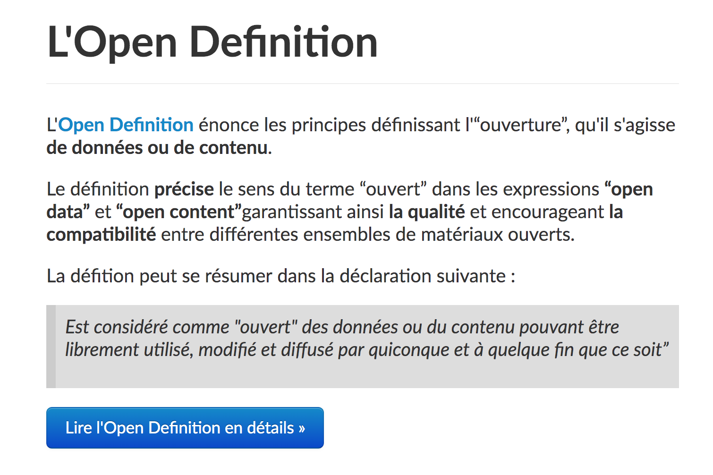

layout: true

`r paste0("
", params$event, " 

")` 

---

class: center, middle

Ces slides en ligne :https://datactivist.coop/ministere-culture/jour1.html

Sources : `r paste0("https://github.com/datactivist/", params$slug)`

Les productions de Datactivist sont librement réutilisables selon les termes de la licence [Creative Commons 4.0 BY-SA](https://creativecommons.org/licenses/by-sa/4.0/legalcode.fr).

 
 

.reduite[]

---
### Rappel des .red[objectifs de la formation]

#### Open Data : comprendre les enjeux de l'ouverture des données publiques culturelles
> * Appréhender le contexte et les opportunités d’une politique Open Data dans la culture.

> * Découvrir des cas pratiques appliqués aux données culturelles.

> * Comprendre les problématiques liées aux données du secteur culturel.

---
### .red[Programme] de la formation

#### Open Data : comprendre les enjeux de l'ouverture des données publiques culturelles

1. Comprendre la donnée : de quoi parle-t-on ? 
2. Histoire de l'open data
3. Les principaux enjeux de l'ouverture des données
4. Cadre juridique de l’ouverture des données culturelles
5. Plusieurs exemples #OpenGLAM
6. Concevoir une stratégie d'ouverture de données : quelques grands principes.

---
class: inverse, center, middle

# De quoi parle t-on ?

---

### .red[Imaginons...]

Vous êtes journaliste (ou étudiant·e en master ou simplement avec une grande curiosité) et vous travaillez sur les festivals en France. Vous souhaitez étudier : la fréquentation, l'historique des festivals... 

* De quoi avez-vous besoin ?
* Comment allez-vous procéder ?

---

class: inverse, center, middle

# 1 - Comprendre la donnée 

---

### .red[Une définition générale] des données 

.pull-left[]
 
.pull-right[
 
##### Les données sont couramment comprises comme les *matériaux bruts produits dans l’abstraction du monde en catégories, mesures et toute autre forme de représentation-nombres, caractères, symboles, images, sons, ondes électromagnétiques, bits qui constituent les fondations sur lesquelles l’information et le savoir sont créés*.

Cette définition est une des rares à s'extraire des discours entourant les données ou leurs infrastructures. L'auteur de cet ouvrage de référence en sociologie s'attache à définir précisément l'ontologie et l'épistémologie de la donnée.
]

---

### .red[La pyramide] Data-Information-Knowledge-Wisdom

.pull-left[

]
.pull-right[
Attribuée à [Russell Ackoff](http://en.wikipedia.org/wiki/Russell_L._Ackoff) en 1989, elle signifie que :

- Les **.red[données]** sont la matière "brute" de l'information conçues plutôt pour des machines.
- **.red[L'information]** pourrait être définie comme des données qui ont été interprétées pour dégager du sens pour des humains.
- En donnant du sens à de l'information, on obtient de la **.red[connaissance]**
- En donnant du sens à la connaissance on obtient de la **.red[sagesse]**.
] 

---

### Une définition .red[des "bases de données"]

Source : [Source : Guide Open Data Cnil](https://www.cnil.fr/sites/default/files/atoms/files/guide_open_data.pdf) 

> On entend par base de données un recueil d'œuvres, de données ou d'autres éléments indépendants, disposés de manière systématique ou méthodique, et individuellement accessibles par des moyens électroniques ou par tout autre moyen (art L112-3 du code de la propriété intellectuelle)

> En d’autres termes il s’agit d’un ensemble de données organisé en vue de son utilisation par des programmes correspondant à des applications distinctes et de manière à faciliter l'évolution indépendante des données et des programmes (en anglais : data base)

Le document donne également une **définition de ce qu'est une "donnée"** :

> Une donnée correspond à la représentation d'une information sous une forme conventionnelle destinée à faciliter son traitement (en anglais : data).

---

### .red[Les données], c'est aussi tout ce qui circule dans un ordinateur

Les données ne sont pas seulement le fondement du savoir, elles sont aussi la base de l'informatique. Tout ce qui circule dans un ordinateur, ce sont des données.

.pull-left[]
.pull-right[
Pensez à votre abonnement téléphonique, chaque mois, vous payez pour consommer un certain volume de données quantifié en octet ou en bit. 

Le volume des données créées et traitées ne cesse de croître en même temps que les capacités de calcul des ordinateurs. 
]

---

### A partir de ces .red[définitions]

* Quelles données avez-vous dans vos services ?

---
class:inverse,middle,center

# 2 - Histoire du mouvement de l'open data

---
### .red[Open data] : un terme récent

Le terme est apparu pour la première fois dans les années 1970 dans les accords qu’a signés la NASA avec des pays partenaires en vue du partage de données satellitaires. 

C’est en 1995 qu’on en voit le premier usage public aux Etats-Unis dans un rapport de la National Academy of Science intitutlé "_On the Full and Open Exchange of Scientific Data_". Dans le langage courant, cela fait .red[**près de 10 ans**] que l'ouverture des données est devenue un élément majeur des politiques publiques numériques. 

---

### Open data, .red[les débuts]

Au début des années 2010, c’est dans le cadre d’un .red[mouvement international] que l’ouverture des données publiques émerge en France. L’initiative vient du monde anglo-saxon, **les États-Unis et le Royaume-Uni mettant en place au même moment des plateformes gouvernementales de partage des données publiques, dans une démarche dite d’open data**. 

Les objectifs de ce mouvement d’ouverture des données publiques sont à la fois

* .red[citoyens] : une plus grande transparence de l’action publique garantit un meilleur contrôle démocratique
* .red[économiques] : les données de l’administration peuvent être le support de nombreuses activités économiques et devraient être diffusées aussi largement que possible. 

Le contexte est alors marqué par l’essor considérable des technologies et de l’économique numérique.

---
class: inverse, center, middle

#### L'open data s'inscrit dans une série de continuités historiques qui en font un **mouvement aux multiples facettes…**

> Il est important de connaître ses fondements philosophiques pour mieux comprendre ses déclinaisons locales et verticales.

---

### L'influence de la .red[culture du logiciel libre]

> Le mouvement de l'open data est largement **influencé par le mouvement du logiciel libre** qui le précède de quelques décennies, et dont les créateurs participèrent à en dessiner les contours, notamment en 2007, lors de la conférence de Sebastopol sur laquelle nous reviendrons. 

**Comment ?**

* Historiquement venu des pratiques des chercheurs en informatique des années 70-80, le partage d'information, de données est un modèle de la recherche scientifique de l'époque. 
* À partir de 1980, des licences d'utilisation des logiciels prévues pour limiter la liberté de l'utilisateur apparaissent.
* 1983 : Réaction d'un chercheur du MIT (Richard Stallman) avec le projet GNU (le logiciel, une forme de connaissance scientifique, qui doit être partagée) formalise le concept de Logiciel Libre.
* 1985: Création de la Fondation pour le Logiciel Libre et rédaction de la General Public License, GPL 

---

### .red[Les principes] du logiciel Libre 

**Les quatre libertés fondamentales** 

* La liberté d'utilisation d'un programme 
* La liberté d'étudier le fonctionnement d'un programme 
* La liberté de modifier un programme 
* La liberté de distribuer un programme

.center[]

> Il faut penser à travers ces principes à la libre expression et liberté d'utilisation, non pas à la gratuité

---

### Open data : un mouvement .red[aux multiples facettes]

**Brève introduction aux principales facettes** : 

* La transparence

* La libre circulation de l'information

* La demande de données brutes

* L'industrie de la donnée

* La modernisation des administrations

---
### [.red[Facette n°1 :]](https://books.openedition.org/cdf/5005?lang=fr) la transparence

Aller au-delà du droit d'accès et de la réédition des comptes (_accountability_) : réduire les asymétries d'information en accédant au matériau brut de l'information et du savoir

.reduite[

]

---
### [.red[Facette n°2 :]](https://books.openedition.org/cdf/5005?lang=fr) la libre circulation de l’information

Dans la lignée de la cybernétique et du logiciel libre, la circulation des données comme valeur essentielle

.center[]

---

###  [.red[Facette n°3 :]](https://books.openedition.org/cdf/5005?lang=fr) la demande de données brutes

Dans la lignée des premières initatives de partage de données scientifiques en génétique ou en astronomie, obtenir les données sous leur forme pré-interprétative pour refaire les calculs

.center[]

---

### [.red[Facette n°4 :]](https://books.openedition.org/cdf/5005?lang=fr) l'industrie de la donnée
Le nouveau pétrole et les promesses démesurées de croissance

.reduite[.center[]]

---

### .red[Facette n°5 :] la modernisation des administrations

Désiloter l'administration et ouvrir l'innovation, collaborer avec la société civile dans l'élaboration et la mise en œuvre des politiques publiques

.center[] 

---

class: inverse, center, middle

# Origines historiques de l'open data dans le monde et en France

---
class: center, middle

## Quelques dates jalon dans .red[l'histoire mondiale de l'open data]

---

### 2005 : [L'Open Definition](https://opendefinition.org/)

#### Une définition juridique des droits de l'usager d'un savoir ouvert

.reduite[.center[]]

---
### 2007 : [la rencontre de Sebastopol aux États-Unis](https://opengovdata.org/)

**Quoi ?** Une rencontre de l'Open Governement Group à Sebastopol (Californie), le siège des éditions O'Reilly

**Pourquoi ?** : Influencer le futur président des Etats-Unis pour faire avancer l'open data

**Comment ?** En adoptant une déclaration définissant les grands principes de l'Open Government Data 

> Ces principes sont fondamentaux dans le futur développement de politiques nationales d’ouverture des données. Ils sont issus de la culture du mouvement du Libre dont les protagonistes sont à l'origine de cette rencontre et réflexion. 

.center[]

---
### 2008 : Tim Berners-Lee ["Des données brutes maintenant !"](https://www.ted.com/talks/tim_berners_lee_on_the_next_web?language=fr)
#### La demande de données brutes sous les projecteurs

.center[.reduite[]]

---
### Depuis 2010 : .red[l'ère des classements]

**[Le baromètre international de l'Open Data](https://index.okfn.org/place/)** est un classement de référence, tout comme l'Open Data Index de l'Open Knowledge Foundation, organisation internationale ayant pour objet de promouvoir la transparence des données publiques.

---

### Depuis 2010 : .red[l'ère des classements]

---

### 2013 : la [charte du G8 sur l'open data](https://www.modernisation.gouv.fr/sites/default/files/fichiers-attaches/charte-g8-ouverture-donnees-publiques-fr.pdf)

.center[]

---
### 2015 : la [charte internationale de l'open data](https://opendatacharter.net/)

.center[.reduite[]]

---

### Conclusion : des .red[principes et une définition] qui se normalisent

* **.red[Une première définition du savoir ouvert] avec l'Open Definition** : "Ouvert signifie que tout le monde peut librement accéder, utiliser, modifier et partager (*des données ou informations*) dans n'importe quel but, sous réserve d'exigences qui en préservent la provenance et l'ouverture."

* **Des principes appropriables par les gouvernements** : le travail du G8 en 2013 et plus tard de la Charte Internationale de l'Open Data rend les principes intégrables par les gouvernements.  

> Les données ouvertes deviennent des données auxquelles l’accès est totalement public et libre de droit, au même titre que l’exploitation et la réutilisation.

> Les données ouvertes culturelles présentent des particularités juridiques que nous allons détailler par la suite

> **Sur ces bases, la France déploie sa politique nationale de données ouvertes**

---

class: inverse, center, middle

## Les origines de l'open data en France

---

### Les .red[acteurs publics] de l'open data

* **DITP** 
* **DINUM** 
* **DINUM - Etalab** : Crée en 2011, la mission coordonne la politique d’ouverture et de partage des données publiques, et anime la plateforme nationale data.gouv.fr
* **Mission Société Numérique de l'ANCT** : Structure les acteurs de l’accompagnement au numérique et les stratégies numériques des territoires, dont l'open data fait partie.

Au ministère de la Culture :
* **Depnum** (Département du numérique pour la transformation des politiques culturelles et de l'administration des données) au sein du Service du numérique
est chargé d’identifier au ministère et dans les établissements culturels, les informations produites dans le cadre des missions de service public, de coordonner leur recensement, leur qualification, et la mise à disposition en données ouvertes qui ont vocation à être librement accessibles et gratuitement réutilisables. (*n’hésitez pas à le contacter pour toute question sur l'Open data*).

---

### .red[Gouvernement Ouvert] et Open Data

Rappel : l'open data n'est pas qu'une pratique d'ouverture et de publication de données, c'est également un **mouvement et une philosophie relatif à un meilleur accès à  l'information publique**.

Plus largement, l'open data s'inscrit dans le mouvement du **gouvernement ouvert**, aussi appelé **OpenGov** en anglais. Celui-ci promeut :

+ La plus grande .red[**transparence de l'information**] (notamment à travers l'open data), pour permettre entre autre le suivi des politiques publiques

+ Une plus forte .red[**participation des citoyens**] dans l'élaboration des politiques publiques : à la fois en étant davantage consulté mais aussi en étant acteur dans la construction de celles-ci

+ Une plus forte .red[**collaboration**] au sein des administrations publiques (casser les silos) et à l'extérieur (travailler avec des acteurs associatifs, privés) pour concevoir et mettre en oeuvre les politiques publiques

---
### .red[OGP/PGO] : Partenariat pour un Gouvernement Ouvert

.center[]

En septembre 2011, un partenariat multilatéral s'est créé afin de promouvoir le gouvernement ouvert et traduire ses valeurs en des actions gouvernementales concrètes : **le partenariat pour un gouvernement ouvert** (PGO), aussi appelé **Open Government Partnership** (OGP)

Initialement fondé par 8 pays (Brésil, Indonésie, Mexique, Norvège, Philippines, Afrique du Sud, Royaume-Uni et États-Unis), le PGO en compte désormais 70, dont la France.

---
### Le .red[plan d'action national] pour la France

Le 17 décembre 2021, le 3e plan d’action national du Partenariat pour un gouvernement ouvert a été présenté par la ministre de la transformation et la fonction publiques.  

[Lire le plan d'action 2021-2023](https://www.modernisation.gouv.fr/outils-et-formations/le-plan-daction-national-2021-2023-pour-un-gouvernement-ouvert)

---

### [Data.gouv.fr](https://www.data.gouv.fr/fr/)

Data.gouv est la plateforme nationale ouverte des données publiques françaises.
Elle a été conçue et inaugurée en 2011, par la mission Etalab, puis refondue en 2013.

On y trouve des milliers de jeux de données, provenant principalement de producteurs publics (Ministère de l'intérieur, Agence française de développement, Insee, Ville de Paris, Région Bretagne, CNIL...) mais aussi de producteurs tiers (OpenStreetMap, OpenFoodFacts...).

.center[] 

---
### Au-delà de .red[data.gouv.fr]

Data.gouv.fr est la plateforme **nationale** d'open data mais ce n'est pas la seule plateforme publique qui met à disposition des données ouvertes. Il existe :

+ Des plateformes open data gérées par les **collectivités territoriales**. Par exemple, [Paris Data](https://opendata.paris.fr/explore/?sort=modified), [la Région Occitanie](https://data.laregion.fr/pages/accueil/), [l'agglomération de Saint-Malo](https://data.stmalo-agglomeration.fr/page/accueil/)...

+ Des plateformes open data gérées par des **ministères**. Exemple : [data.culture.gouv.fr](https://data.culture.gouv.fr/pages/home/)

+ Des plateformes open data gérées par des **entreprises**. Exemple [DataNova](https://datanova.laposte.fr/page/accueil/) (La Poste)

+ Des jeux de données directement publiés sur le site des producteurs de données, sans plateforme dédiée.

---

### Les grandes fonctionnalités .red[d’un portail open data]

Un portail open data est un espace de présentation des données publiques ouvertes comprenant idéalement les grandes fonctions suivantes :

* recherche des jeux de données

* présentation détaillées des jeux de données

* accès aux données, sous différents formats, y compris API

* présentation graphique et cartographique des données quand cela est possible

* outils d'extraction ou de transfert des données

* dispositifs éditoriaux pour animer le projet open data

---
class: center, middle

### Et au .red[Ministère de la Culture]

> Le ministère de la culture s’est doté en avril 2013 d’une « feuille de route open data », comportant dix actions pour une stratégie numérique de diffusion et de réutilisation des données publiques numériques du secteur culturel. 

---

### Les .red[dates importantes] à retenir

.red[**2011**] : Le ministère s'engage dans la politique gouvernementale en faveur de l’ouverture et du partage des données publiques. Les premiers jeux de données sont publiés par le Ministère sur data.gouv.fr

.red[**2013**] : Adoption de la première feuille de route « open data culturel ». Elle est mise à jour en [**2019**](https://www.culture.gouv.fr/Thematiques/Innovation-numerique/Actualites/Feuille-de-route-open-data2). Elle comporte 6 axes pour une stratégie numérique de diffusion et de réutilisation des données publiques numériques du secteur culturel.

.red[**2014**] : La BnF ouvre ses métadonnées descriptives en "Licence Ouverte" 
.red[**2014/2015**] : Publication de la feuille de route «Métadonnées culturelles et transition Web 3.0»

.red[**2016**] : Ouverture du portail [data.cuture.gouv.fr](https://data.culture.gouv.fr/))

.red[**2017**] : Les Archives nationales optent pour l’ouverture et la gratuité des données

.red[**2021**] : Une nouvelle nouvelle feuille de route "Données et contenus culturels" et nomination d'un AMDAC

---

class: inverse, center, middle

# 3 - Les principaux enjeux de l'open data 

---

### .red[La transparence de la vie publique] et la participation citoyenne à l’action publique

* Exemple avec les [**Données essentielles des conventions de subvention**](https://data.culture.gouv.fr/explore/dataset/donnees-essentielles-des-conventions-de-subvention/information/), année 2018

.center[]

---

### La participation citoyenne .red[à l’action publique]

* Exemple : [le **Grand Débat National**](https://granddebat.fr/), mars 2019

.center[]

---

### .red[L’efficacité de l’action publique] : amélioration de la qualité des services publics 

* Exemple : [**sauver des vies en mer**](https://damp-basin-47015.herokuapp.com/defis/2018/donneesauvetagemaritime.html) en prévenant les accidents maritimes

.center[]

---

### Le développement de .red[l’attractivité des territoires]

* Le portail [**DATAtourisme**](https://www.datatourisme.gouv.fr/)

.center[]

---

### Le soutien à .red[l’innovation économique et sociale]

* Les données des [**valeurs foncières**](https://www.meilleursagents.com/prix-immobilier/dvf/) reprises par le site meilleurs agents, avril 2019

.center[]

---

### Une opportunité en matière de .red[démocratisation culturelle et de transmission des savoirs]

* Le projet [**UrbanHist**](https://www.urban-hist.toulouse.fr/) à Toulouse

.center[]

---

### .red[Focus sur le secteur culturel :] la feuille de route **Données et contenus culturels**

Cette [feuille de route](https://www.culture.gouv.fr/Espace-documentation/Documentation-administrative/Feuille-de-route-Donnees-et-contenus-culturels). Elle concerne les données, les algorithmes et les codes sources.

La publication des feuilles de route est le fruit d’une volonté politique renouvelée et portée par le Premier ministre qui s’est vu remettre le 23 décembre 2020 le rapport de la mission parlementaire présidée par Eric Bothorel et par la publication de la circulaire d'avril 2021 du Premier Ministre.

Elle s'articule autour de trois axes prioritaires :
* Améliorer la capacité du ministère à diffuser et rendre visible les contenus
culturels ;
* Contribuer à l’efficacité des actions du ministère et à la simplification des
relations entre les usagers et le service public culturel ;
* Faire bénéficier un secteur économique de la culture fragilisé par la crise COVID-19 des opportunités de reprise et de développement présentées par l’usage des données.

---

### Pour les .red[services centraux, les DRAC et les SCN] : des données hébergées sur data.culture.gouv.fr

Pour les données de l'administration centrale, d'une DRAC ou d'un SCN, la mise à disposition des données est à effectuer sur le site  .red[data.culture.gouv.fr.]

Afin d’améliorer la visibilité des données culturelles, **le portail data.culture.gouv.fr est moissonné automatiquement par data.gouv.fr**, pour pouvoir les exposer sur les deux plateformes à la fois. 

*Pour toute information sur la mise à disposition de nouveaux jeux de données, contacter le département du numérique pour la transformation des politiques culturelles et de l'administration des données (Service du numérique) via l’onglet « Contact » de la plateforme data.culture.gouv.fr.*

---

### .red[Pour les établissements publics] : des données hébergées sur data.gouv.fr et visibles (aussi) sur data.culture.fr

Pour les établissements publics, la mise à disposition des données est à effectuer sur le site .red[data.gouv.fr.]

Afin d’améliorer la visibilité des données culturelles, le Ministère référence également les données des établissements sur la plateforme ministérielle data.culture.gouv.fr.

Cela implique la création d’une page dédiée à l'établissement, puis la publication des jeux de données conformément [aux modalités précisées par la DINUM](https://doc.data.gouv.fr/jeux-de-donnees/publier-un-jeu-de-donnees/)

> **Le ministère mettra en place les mécanismes nécessaires pour que toutes les données publiées de cette façon soient ensuite automatiquement visibles sur data.culture.gouv.fr.**

---

### Culture : principales catégories de données .red[concernées par l’ouverture]  

* Les **données statistiques** des institutions culturelles : fréquentation, entrées, équipements
* Les **bases de données des collections** : métadonnées et plus largement les données associées aux œuvres (localisation, description, auteur, œuvres associées, prix, propriétaire) avec images ou sans image
* Les **listes de structures** : musées, monuments, cinéma, etc.
* Les référentiels ou nomenclatures 
* Les données de type **agenda**, événements, programmations
* Les **données financières** : financement, ressources, budgets annuels, subventions

> Important : les œuvres protégées par le droit d’auteur ou un droit voisin ne peuvent faire l’objet d’un droit de réutilisation, mais les œuvres entrées dans le domaine public relèvent pleinement de l’ouverture des données publiques.

---

### Que signifie .red[“Open”] dans un contexte culturel ?

* **L’Open Content** (les contenus ouverts) est la mise à disposition gratuite sur Internet des reproductions numériques des œuvres sous une licence garantissant leur libre accès et leur réutilisation par tous, sans restriction technique, juridique ou financière.

* **L’Open Access** (le libre accès) est la mise à disposition gratuite en ligne de contenus numériques, sous licences libres (Creative commons, etc.) ou non.

* **L’Open Knowledge** (la culture libre) est un mouvement social qui promeut la liberté de distribuer et de modifier des œuvres de l’esprit sous la forme d’œuvres libres. Il puise sa philosophie dans celle du logiciel libre en l’appliquant à la culture et à l’information.

* **L’Open Data** (les données ouvertes), est la mise à disposition gratuite sur Internet de données sous une licence libre. 

---

class: inverse, center, middle

# 4 - Éléments juridiques relatifs à l'ouverture des données

---

### .red[Du droit d'accès] au droit de réutilisation des données publiques en France

Trois grandes étapes caractérisent en France la **construction d’un droit de l’ouverture des données publiques** : 

* 1 - La création du droit d’accès aux documents administratifs

* 2 - La création du droit de réutilisation des informations publiques

* 3 - Le développement d’une politique active d’ouverture des données, assorti d’un essor de la gratuité. 

---
### Un appareil législatif .red[étoffé]

1. **Loi Informatique et liberté** du 6 janvier 1978

1. **Loi CADA** du 17 juillet 1978

1. **Directive INSPIRE** de 2007

1. **Directive PSI** de 2013

1. **Loi Valter** de 2015

1. **Loi pour une République Numérique** (loi Lemaire) du 7 octobre 2016.

> 2 éléments cohabitent dans ces textes : le droit d'accès et le droit de réutilisation

---

### .red[1978] : La loi CADA, vers le "droit de savoir"
* Le fondement : la .red[Déclaration des Droits de l'Homme et du Citoyen de 1789] dans son article 15, "la Société a le droit de demander compte à tout Agent public de son administration." 

* Le droit d'accès des citoyens à l'information publique émerge en **1978 avec la loi dite CADA** du nom de la Commission d'Accès aux Documents Administratifs. 

* La France était le .red[3e pays au monde] après la Suède en 1766 et les Etats-Unis en 1966 avec le Freedom of Information Act (FOIA) en 1966  à accorder un "droit de savoir" avec pour but d'améliorer les relations entre le public et l'administration.

>La loi CADA est intégrée au Code des relations entre le public et l'administration (CRPA) qui, dans son [livre 3](https://www.legifrance.gouv.fr/affichCode.do;jsessionid=BDF8EC0BD562E214CCD9A5ADD435D690.tplgfr42s_1?idSectionTA=LEGISCTA000031367685&cidTexte=LEGITEXT000031366350&dateTexte=20190429) codifie le droit d'accès et de réutilisation

---

### .red[Les conditions d'exercice] du droit d'accès aux documents administratifs

Une définition .red[très large] des documents administratifs
> Les documents administratifs peuvent revêtir de nombreuses formes (dossiers, rapports, études, comptes rendus, procès-verbaux, statistiques, directives, instructions, circulaires, codes sources, etc.) et adopter tout support (écrit, enregistrement sonore ou visuel, forme numérique ou informatique). 

Le droit d'accès s'appplique dans le cadre d'une .red[mission de service public] ie :
> Une mission d'intérêt général sous le contrôle de l'administration et qui est dotée à cette fin de prérogatives de puissance publique est chargée de l'exécution d'un service public. 

Il ne s’exerce que si l’administration a effectivement en sa possession le document demandé, que si le document est formellement **achevé**, qu'il existe et qu'il n'est pas **préparatoire à une décision administrative** en cours. 

---
### .red[Les exclusions] au droit d'accès

Le droit d'accès .red[**ne doit pas porter atteinte aux secrets protégés**] : 
- le fonctionnement de l'État : délibérations du Gouvernement, secret de la défense nationale, la conduite de la politique extérieure de la France, la sûreté de l'État…
- la protection de la vie privée
- le secret médical
- le secret des affaires (secret des procédés, des informations économiques et financières et
des stratégies commerciales ou industrielle)
- les mentions portant une appréciation ou un jugement de valeur sur une personne physique ou
faisant apparaître un comportement d'une personne pouvant lui porter préjudice…

Le document ne peut être publié qu'après avoir fait l'objet d'un traitement permettant
d'.red[**occulter les mentions protégées**]. L’administration n’est pas tenue de publier un document lorsque “les travaux d’occultation dénatureraient ou videraient de sens le document” ou si “le document est indivisible ou l’occultation est trop complexe”.

---

### La création du .red[droit de réutilisation des informations publiques] avec la Directive ISP/PSI

* Partant du constat que le secteur public produit et diffuse un grand nombre d’informations et qu'elles « constituent une matière première importante pour les produits et services de contenu numérique », la directive PSI de 2003 concernant la réutilisation des informations du secteur public se fonde sur des considérations économiques. .red[**Elle introduit la notion de réutilisation commerciale et non-commerciale.**]

> En France, elle est transposée par l'ordonnance du 6 juin 2005, qui insère dans la loi CADA de 1978 un nouveau chapitre relatif à la réutilisation des informations publiques.

---

### Le .red[droit de réutilisation des informations publiques] 

Le droit de réutilisation issu de la directive PSI *se combine donc en France avec le droit d’accès aux documents administratifs* reconnu depuis 1978 : les informations contenues dans tout document administratif communicable sont, en principe, réutilisables « _par toute personne qui le souhaite à d'autres fins que celles de la mission de service public pour les besoins de laquelle les documents ont été élaborés ou sont détenus_ ». 

> Par cette combinaison, le droit français garantit ainsi une liberté effective de réutilisation bien plus grande que celle imposée par la directive ISP. Le principal apport de la transposition au droit français est d’avoir mis fin à l’interdiction de réutilisation des documents administratifs à des fins commerciales.

---

### .red[La loi pour une République Numérique] : une obligation de diffusion et un accès actif aux données

* **La loi est promulguée le .red[7 octobre 2016]**

Elle a pour objectifs de : 
* Encourager l’innovation et l’économie numérique
* Promouvoir une société numérique protectrice 
* Garantir l’accès de tous au numérique (Haut débit..)

[Source](http://www.vie-publique.fr/actualite/dossier/loi-internet/republique-numerique-que-change-loi-du-7-octobre-2016.html)

---

### .red[L'ouverture des données par défaut], un premier principe fondamental de la Loi Lemaire

> Les administrations devront publier en ligne dans un standard ouvert leurs principaux documents, y compris leurs codes sources, ainsi que leurs bases de données qui présentent un intérêt économique, social, sanitaire ou environnemental. 

Cette obligation concerne toutes les *administrations*, établissements publics, collectivités et organismes privés chargés d’un service public, à deux conditions : être dôté d'au moins **50 agents** et, pour les collectivités locales, concerner au moins **3500 habitants**.

---
### .red[Le périmètre] de l'open data par défaut 

L'ouverture concerne un .red[**périmètre très large**] : 
* les documents communiqués suite à des demandes CADA

* les "bases de données"

* les données "dont la publication présente un intérêt économique, social, sanitaire ou environnemental".

> Rares sont donc les données publiques qui ne sont pas concernées par cette obligation d'ouverture. 

---

### .red[Création d’un] service public de la donnée

* La loi souhaite faciliter la réutilisation des principales bases de données de l’État par les acteurs privés ou publics (entreprises, associations, chercheurs, etc.), en leur garantissant un niveau élevé de qualité de service.

* La loi propose de mettre à disposition comme “service public” les grandes bases de données de référence de l’État , comme par exemple le répertoire SIRENE des entreprises ou le cadastre. 

---

### Les 9 jeux de données du .red[Service Public de la Donnée]

* Le répertoire des entreprises et des établissements (base Sirene)
* Le répertoire national des associations (RNA),
* Le plan cadastral informatisé,
* Le registre parcellaire graphique (RPG)
* Le référentiel à grande échelle (RGE),
* La base adresse nationale (BAN),
* Le répertoire opérationnel des métiers et des emplois (ROME),
* Le référentiel de l’organisation administrative de l’Etat,
* Le code officiel géographique (COG).

Le service public de la donnée sur [data.gouv.fr](https://www.data.gouv.fr/en/reference)

---

### .red[La LRN encourage] l'utilisation de standards ouverts

Afin de faciliter la réutilisation des données par les machines, la loi pour une République Numérique consacre **l'utilisation de standards ouverts** pour la communication des documents administratifs. 

L’administration est dorénavant tenue, lorsqu’elle communique un document administratif au format électronique, de le mettre à disposition du citoyen **"dans un standard ouvert, aisément réutilisable et exploitable par un système de traitement automatisé"**. 

Concrètement, cela devrait empêcher la publication de fichiers PDF là où un fichier CSV pourrait être diffusé.

---

### Ainsi qu'une .red[limitation des licences]

La loi **limite par décret les licences** qui peuvent être utilisées par les administrations. Le [décret du 27 avril 2017](https://www.legifrance.gouv.fr/eli/decret/2017/4/27/2017-638/jo/texte) autorise deux licences : 

* la Licence Ouverte d'Etalab 

* la licence ODbL (Open Database License).

Ces deux licences offrent **un choix aux administrations** : la licence ouverte étant plus permissive que la licence ODBL qui a été conçue dans une logique de "pot commun" permettant de garantir que les données resteront ouvertes après leur réutilisation.

Utiliser une autre licence impose une **homologation** auprès de la DINUM avec un exposé des motifs ayant conduit à sortir de la liste fixée dans le décret et une consultation des usagers affectés par la licence proposée. L'homologation doit être faite pour chaque jeu de données même si la licence reste la même.

---

### Zoom sur la .red[Licence Ouverte] et .red[l'ODBL] 

---
### .red[Les données à exclure] du périmètre de l'open data

**Les informations sur lesquelles des tiers détiennent des droits de propriété intellectuelle**

**Les informations contenant des données à caractère personnel ou pouvant affecter la vie privée des citoyens**

**Les données couvertes par un secret**

* Exemple : 
Vous voulez publier des photographies ? Il faut vérifier que :

> * Soit, les images appartiennent au domaine public
> * Soit, vérifier si un contrat de cession de droits existe entre l'établissement et le/la photographe
> * Sinon, l'auteur (ou ayant-droit) dispose de droits sur l'image

---
### Le cas des .red[données personnelles]

La réutilisation de données à caractère personnel doit être faite dans le respect de la règlementation sur les données à caractère personnel (loi relative à l’informatique, aux fichiers et aux libertés et au RGPD).

La mise en ligne de données à caractère personnel sans anonymisation n'est permise que dans .red[**trois cas**] :
1. une disposition législative contraire le prévoit (exemple : [l’article D312-3-1 du CRPA](https://www.legifrance.gouv.fr/affichTexte.do;jsessionid=51E99AF738C12521572D6A7F6C8C03E8.tplgfr23s_1?cidTexte=JORFTEXT000037797147&dateTexte=&oldAction=rechJO&categorieLien=id&idJO=JORFCONT000037796937)
2. si les personnes intéressées ont donné leur accord (consentement au sens de l’article 4 et 7 du RGPD)
3. Les données ont été [anonymisées](https://github.com/SGMAP-AGD/anonymisation/wiki/Guide-de-l'anonymisation) : elles ne doivent plus se référer à une personne réelle (exit les noms, identifiants…). 

---

### La réutilisation des données et .red[le régime dérogatoire pour le secteur culturel]

> Un principe : .red[la gratuité] et un régime dérogatoire pour le secteur culturel.

* Lorsque la réutilisation porte sur *des informations issues des opérations de numérisation des fonds et des collections des bibliothèques, y compris des bibliothèques universitaires, des musées et des archives et, le cas échéant, sur des informations qui y sont associées lorsque ces dernières sont commercialisées conjointement*. Dans de cas, une **redevance** peut être mise en place, en respectant une règle de calcul  prévue par la règlementation.

> Les données publiques nativement numériques ne peuvent pas faire l'objet d'une redevance.

---

### Réutiliser des informations publiques .red[dans le domaine de la culture]

Pour résumer :

* La licence ce n'est pas obligatoire

* La gratuité est obligatoire **sauf** exception

Mais, il faut garder à l'esprit que cela va dépendre du type de réutilisation :

* Dans le cas de réutilisations non commerciales : La licence ce n'est pas obligatoire, mais si c'est le cas : LO ou OdBL (ou une licence homologuée sur autorisation)

* Dans le cas de réutilisations commerciales : **si** une redevance est appliquée, l'adoption d'une licence spécifique est obligatoire

> En juillet 2017, les Archives nationales se sont engagées dans l’Open data en consacrant le principe de gratuité pour toute réutilisation aux ressources libres de droits qu’elles conservent.

---

class: inverse, center, middle

## Prenons maintenant connaissance des principes généraux d'ouverture des données et regardons leur application concrète

.footnote[Tels que définis dans les "huit principes des données publiques ouvertes", définis les 7-8 décembre 2007 lors de la rencontre Sébastopol, citée plus haut. Source: [opengovdata.org](https://opengovdata.org/)]

---
class: center, middle

### 1. Des données .red[complètes]

> **Toutes les données publiques doivent être rendues disponibles dans les limites légales liées à la vie privée ou la sécurité**

C'est le **principe d'open data par défaut** 

---
class: center, middle

### 2. Des données .red[primaires]

> **Les données ouvertes sont telles que collectées à la source, non-agrégées avec le plus haut niveau de granularité**

---
### .red[Trouver] des données granulaires

.pull-left[

Le portail Data Culture basé sur la solution OpenDataSoft permet de trouver rapidement les données plus granulaires en triant les données par le nombre d'enregistrements dans le catalogue de données. 

]

.pull-right[
On trouvera ainsi facilement la [base Joconde](https://data.culture.gouv.fr/explore/dataset/base-joconde-extrait/information/) qui décrit les oeuvres des musées de France et contient environ 600 000 notices.

]

---
class: center, middle

### 3. Des données .red[fraîches] (*timely*)

> **Les données doivent être disponibles dès qu'elles sont produites**

---
### .red[Un exemple de] données temps réel

La ville d'Issy les Moulineaux ouvre les [données temps réel de l'affluence](https://data.issy.com/explore/dataset/affluences-temps-reel/map/?sort=open&refine.secondary_name=M%C3%A9diath%C3%A8que+d%27Issy-les-Moulineaux&location=15,48.83064,2.26653&basemap=mapbox.streets) dans ses structures dont la médiathèque. Ces données sont exploitées notamment par l'application [Affluences](https://www.affluences.com/).

.reduite[
.center[

]
]

---
class: center, middle

### 4. Des données .red[accessibles] 

> **Les données doivent être utilisables par le plus grand nombre d’usagers potentiels**

---
class: center, middle

### 5. Des données .red[exploitables par les machines] 

> **Les données peuvent être traitées automatiquement par les machines** 

---
### .red[Exemple :] le nombre de flashs par radars en France

.pull-left[
Le ministère de l'Intérieur publie les statistiques du nombre de flashs sur les radars en France mais sous la forme de fichiers PDF. Ces tableaux de données sont inexploitables par les machines, on ne peut pas les importer simplement dans un outil d'analyse de données. 

]
.pull-right[
A la suite d'une conversation sur [TeamOpenData](), un citoyen a extrait ces données avec l'outil [Tabula](tabula.technology) et les a republié sur data.gouv.fr dans un format lisible par les machines. Plusieurs cartes ont été produites à la suite. 

]

---
class: center, middle

### 6. Des données .red[non discriminatoires]

> **Elles peuvent être utilisées par tous sans réclamer un enregistrement préalable**

.pull-left[ 

Pour consulter ou télécharger les données du portail DataTourisme, il faut s'inscrire sur le site et créer un compte obligatoire.

]

.pull-right[

Suite au signalement de cette obligation et à une [discussion sur TeamOpenData](https://teamopendata.org/t/lancement-de-la-plateforme-datatourisme/145/18?u=samgoeta), ces données ont finalement été rendues accessibles à tous sur le portail [data.gouv.fr](https://www.data.gouv.fr/fr/datasets/datatourisme-la-base-nationale-des-donnees-du-tourisme-en-open-data/)

]

---
class: center, middle

### 7. Des données publiées .red[dans un format ouvert]

> **Ce format ne doit pas être la propriété d'une organisation en particulier (.xls) et doit être gouverné par ses usagers**

---

### .red[Exemples courants] de fichiers excels publiés

.pull-left[

A éviter : police ou colonnes en couleur pour signifier une légende particulière pour les données.

]

.pull-right[

#### Ce fichier de la [fréquentation des musées en France](https://data.culture.gouv.fr/explore/dataset/frequentation-des-musees-de-france/information/?disjunctive.new_name) a depuis été mis à jour sur Data-Culture avec une infographie. 

]

---

class: center, middle

### 8. Des données publiées .red[sous une licence ouverte]

> Licences prévues par la règlementation

---

class: inverse, center, middle

# 6 - Des exemples #OpenGLAM

---

### Open GLAM : une communauté engagée pour l'ouverture des données et contenus culturels

.red[**OpenGLAM**] est un réseau mondial de personnes et d'organisations engagées à ouvrir du contenu et des données détenues par des galeries d'art, des bibliothèques, des archives et des musées.

.center[
**GLAM** : Galleries, Libraries, Archives and Museums.
]

---

class: center, middle

### Des exemples internationaux

---
### Le .red[Getty Museum]

.pull-left[
* En 2013, le Getty Museum place les reproductions de 4 600 de ses œuvres sous le régime de l’Open Content. 

* Aujourd’hui, c'est près de 200 000 œuvres qui sont concernées. 

* Les images, téléchargeables en HD, sont réutilisables pour tout usage, commercial ou pas.

* Licence : aucune licence (Domaine Public)

[En savoir plus](https://www.getty.edu/about/whatwedo/opencontent.html)

]

.pull-right[

]

---

### Le Palais national .red[de Taiwan]

Entre 2015 et 2017, le Palais national de Taiwan, a ouvert 70 000 images sur une plate-forme dédiée National Palace Museum Open Data, qui permet de télécharger sans restriction des images d’œuvres et des jeux de données sur ses expositions. Ceci a été réalisé au terme d’un grand projet de numérisation de ses collections et en lien avec la politique de gouvernement ouvert du pays.

.center[]

Licence : Open government data licence ou CC-BY-4.0

[En savoir plus](https://theme.npm.edu.tw/opendata/?lang=2)

---

### .red[Rijksstudio]

Lancé en 2012 pendant la période de travaux du .red[Rijksmuseum d’Amsterdam], le Rijksstudio est d’abord le catalogue en ligne des collections de l’institution. 

Licence : ?

[En savoir plus](https://www.rijksmuseum.nl/en/rijksstudio)

---
### .red[Cleveland Museum of Arts]

Le 23 janvier 2019, le Cleveland Museum of Art a annoncé qu'il devenait une institution en libre accès, utilisant la désignation Creative Commons Zero (CC0) pour les images et les données haute résolution liées à sa collection. 

Les + de la démarche : tableau de bord des effets de la [stratégie open content](https://www.clevelandart.org/art/collection/dashboard#page-0) et contenus 3D ouverts.

Licence : CC0

[En savoir plus](http://www.clevelandart.org/open-access)

---

### .red[Mais aussi...]

* Le [MET](https://www.metmuseum.org/about-the-met/policies-and-documents/open-access), CC0

* Le [Smithsonian](https://www.si.edu/termsofuse), CC0

Carte de Douglas McCarthy, [*Global instances of Open GLAM, March 2022*](https://medium.com/open-glam/four-years-of-the-open-glam-survey-eadebf8bd743)

.center[]

---

class: center, middle

### Des exemples en France

---

### POP, la .red[plate-forme ouverte du patrimoine] du Ministère de la Culture

> La plateforme POP regroupe les contenus numériques du patrimoine français afin de les rendre accessibles et consultables au plus grand nombre sur : .red[**pop.culture.gouv.fr**]

Plus de 3,3 millions de fiches y sont actuellement présentes, issues des bases historiques du ministère.

* POP propose plusieurs types de recherche : une recherche par texte libre, par facettes, une recherche cartographique ainsi qu'une recherche avancée par base de données.

* Conçue et développée dans le cadre d’une start-up d’État soutenue par les services du Premier ministre, POP a vocation à remplacer l’ancien système de bases de données du ministère de la Culture, utilisé depuis les années 1970.

* La plate-forme permet de verser l’essentiel des métadonnées (à ce stade pas les images) sur les plateformes data.culture.gouv.fr et data.gouv.fr

---

### .red[Paris Musées]

.pull-left[Le 8 janvier 2020, Paris Musées lançait sa politique d'Open Content en proposant des reproductions numériques des œuvres des collections des musées de la Ville de Paris. Un an après ils annoncent :  2,5 millions d'images téléchargées en 2020 et 250 000 images disponibles.

Licence : CC0

[En savoir plus](https://www.parismuseescollections.paris.fr/fr/conditions-generales-d-utilisation)

]

.pull-right[

]

---

### .red[Archives Nationales]

.pull-left[En 2017, les Archives Nationales ont fait le choix de l'open content en soumettant les documents qu'elles détiennent au principe de gratuité totale.

Licence : aucune

[En savoir plus](https://www.archives-nationales.culture.gouv.fr/fr/web/guest/reutilisation-des-donnees-publiques?utm_source=dlvr.it&utm_medium=twitter)

]

.pull-right[

*AN, CP/F/12/4055/D/C, Pièce 25 "Exposition universelle de 1889". "Histoire de l'habitation Phénicie : façade principale"*
]

---
### .red[Les collections en partage] du musée de Bretagne

.pull-left[
En 2017, la plateforme **collections.musee-bretagne.fr** propose ses collections en téléchargement gratuit. Une volonté de la métropole de Rennes de rendre accessibles les collections, participant ainsi à la consolidation de sa politique d’ouverture des données de la collectivité. La licence appliquée autorise la réutilisation des documents (images et notices), y compris à des fins commerciales.

Licence : de différents types
] 

.pull-right[

.center[]

*Fileuse (Morbihan) – Négatif sur verre – Jeanne-Marie Barbey (1876-1960), début 20ème siècle – CC-BY-SA*
]

---

### DoReMus :  .red[DOing REusable MUsic Data]

Un projet de recherche en collaboration .red[avec de multiples partenaires culturels]

Le projet s’appuie sur **l’expertise de catalogage des œuvres musicales** de : 

* Radio France
* la BnF
* la Cité de la musique
* du projet collaboratif Discotheka de la société Meaning Engines 
* et sur un corpus de modèles préexistants, en particulier FRBRoo. 

.red[**Un moteur de recherche] liant les données sur les dates des performances, les interprètes, les enregistrements, les instruments, les partitions, etc.. **

* **Site du projet** : http://data.doremus.org/

* **Github du projet** : https://github.com/DOREMUS-ANR 

Licence : CC-BY 4.0

.reduite[]

---

### .red[SocFace]

Projet de mise en données des recensements de population détenus par les services d'archives départementales de 1836 à 1936. Le projet est de développer des technologies de reconnaissance automatique d’écriture manuscrite pour analyser l’ensemble des listes nominatives et produire une base de données des individus ayant vécu en France durant cette période.

Projets multipartenarial et réalisé dans le cadre d'une ANR.

L'open access et la mise à disposition des données est prévue dans le cadre du projet.

[En savoir plus](https://socface.site.ined.fr/fr/)

.center[]

---

class: center, middle

### Quels sont les éléments important de ces démarches ?

---

### Nouer des .red[partenariats]

> Afin de donner de la visibilité ses collections, le département de Haute-Saône, a **réalisé un partenariat avec Wikimédia**, pour diffuser et valoriser [les données d'images haute définition des collections départementales](https://commons.wikimedia.org/wiki/Commons:Mus%C3%A9es_d%C3%A9partementaux_de_la_Haute-Sa%C3%B4ne) sous licence libre. 

.pull-left[
Le château de Champlitte, qui abrite le musée départemental d'Arts et Traditions populaires.

.reduce[*Jérôme BARDIAU, CC BY-SA 4.0, via Wikimedia Commons*]
]

.pull-right[

]

---

### Verser une collection sur une .red[plateforme collaborative]

* Possibilités pour la recherche, l’innovation et la créativité de cette rencontre entre des collections de qualité bien documentées et l’encyclopédie collaborative en ligne. 

* **Rendre accessible une collection tandis que le bâtiment est fermé** ou en l’absence (c’est le cas de petits musées) de portail des collections

* **Donner une visibilité aux œuvres** par leur remploi dans l’écriture des articles de Wikipédia, ou les inscrire dans le référencement sémantique multilingue que permet le développement du projet Wikidata. 

En effet, les articles Wikipédia jouent un rôle important de “porte d’entrée” vers les œuvres utilisées pour les illustrer, les métadonnées peuvent être traduites en anglais et des catégories peuvent être créées pour une recherche plus facile. 

> **Les collections de musées versées sur Wikimédia bénéficient d’un potentiel de reconnaissance et d’étude inconnu jusque-là.**

---

### Mettre à disposition des .red[données de références]

Data.bnf.fr extrait, transforme et regroupe dans une **base commune** des metadonnées issues de ressources internes et extérieures, produites dans des formats différents, afin de les lier entre elles et de les rendre interopérables.
Ses pages sont indexées par les moteurs de recherche.

> Le site permet de rassembler autour de ses pages auteur, œuvre, thème, date et lieu, des ressources de la Bibliothèque nationale de France, ainsi que des ressources extérieures. 

---

### Profiter du potentiel du .red[web semantique]

[Crotos](https://zone47.com), est un moteur de recherche qui s’appuie sur Wikidata et donne ainsi accès à des œuvres en s'appuyant sur la force du web semantique. 

[Paladia](http://zone47.com/crotos/palladia/), est un moteur de recherche et d'affichage d'une partie des collections du Musée Saint-Raymond.

---

class: inverse, center, middle

# 7 - Concevoir une stratégie open data

---

class: middle

### Comment ouvrir ses données : .red[les différentes étapes] pratiques à suivre

* **Étape 1** : Sélectionner les données

* **Étape 2** : Préparer les données

* **Étape 3** : Diffuser et valoriser les données

---

### .red[Réussir sa stratégie] d'ouverture des données 

- Au-delà de l'obligation légale : .red[**poser les objectifs**] poursuivis par la stratégie

- Se donner les moyens de connaître la .red[**demande de données**] pour y répondre 

- Travailler à la .red[**qualité des données**], garante d'usages réels

- Mener le projet d'ouverture des données comme un projet de modernisation de l'administration (transversalité, agilité, lean...)

---

### Les .red[freins] à l'ouverture des données

* **Les ressources nécessaires (temps, RH et finances)** : extraction, anonymisation, hébergement des données, numérisation des œuvres ...  
_Pour y palier : accompagner les opérateurs et évaluer les risques/bénéfices, fixer une feuille de route open data pour prioriser/rationnaliser._

* **Une mise en qualité insuffisante** : une qualité jugée suffisante pour des usages internes pour lesquels elles sont produites peut être jugée insuffisante pour le grand public : fichiers incomplets, de mauvaise qualité ou avec des erreurs.  
_Pour y palier : compter sur l’intelligence collective et l'interraction avec les usagers pour permettre l'amélioration des données (avec le crowdsourcing par exemple)._

* **La crainte d'un mauvais usage** : quelques rares cas de mauvaises réutilisations avec des données détournées de leur contexte ou utilisées à de mauvaises fins.  
_Pour y palier : renseigner les métadonnées qui accompagnent le jeu de données._

---

### Bien penser sa stratégie open data, c'est .red[s'assurer l'enthousiasme des gestionnaires et réutilisateurs]

.pull-left[

* **De nombreux profils et équipes doivent s'emparer de l'open data**

Une bonne stratégie consiste à réduire les frictions :

]
.pull-right[

* ####  Rendre les données moins difficiles à trouver (*enjeu de trouvabilité*)

* ####  Publier les données avec une bonne granularité temporelle et spatiale

* ####  Documenter les jeux de données pour en comprendre la structure

* #### Veiller à leur mise à jour la plus fréquente possible

* #### Rendre les portails attractifs à tous (et pas qu'aux développeurs web) 

]

---

### Résumé : les .red[facteurs clés de succès] d'une stratégie open data

#### Obtenir un soutien au plus haut niveau
* Pour mettre en œuvre les moyens et les ressources à déployer

#### Configurer l’organisation pour l’ouverture
* Organiser la gouvernance, les circuits de validation 

#### Faciliter la découverte et l’utilisation des données 
* Faire attention au référencement, à la qualité des métadonnées 

#### Rester à l'écoute et interagir avec les usagers 
* Prévoir des boucles de participation

---

### Bibliographie 1/3

* [Politique du Ministère de la Culture pour  les codes sources, algorithmes et codes sources](https://www.culture.gouv.fr/content/download/314733/pdf_file/Politique_CALL_version_01_2022-06-29.pdf?version=1), juin 2022

* [**Feuille de route – Données et contenus culturels**](https://www.culture.gouv.fr/Espace-documentation/Documentation-administrative/Feuille-de-route-Donnees-et-contenus-culturels), Publiée par le ministère de la Culture, septembre 2021

* [**Guide pratique dédié à l’ouverture des données publiques culturelles**](http://www.culture.gouv.fr/Media/Thematiques/Innovation-numerique/Folder/Guide-pratique-dedie-a-l-ouverture-des-donnees-publiques-culturelles)
Publié par le ministère de la Culture, juillet 2019 

---

### Bibliographie 2/3

* [**Outil pédagogique facilitant la compréhension des droits de propriété littéraire et artistique applicables aux contenus culturels dont la diffusion est souhaitée**](https://www.culture.gouv.fr/droitsdediffusion/) 

* [**Numérisation et valorisation des contenus culturels : guide ouverture et réutilisation des informations publiques numériques du secteur culturel**](http://www.culture.gouv.fr/Media/Thematiques/Innovation-numerique/Folder/Livrables-GT-Numerisation/Numerisation-et-valorisation-des-contenus-culturels-guide-ouverture-et-reutilisation-des-informations-publiques-numeriques-du-secteur-culturel),publié par le ministère de la Culture, 2017

* [**Guide de bonnes pratiques en matière de propriété littéraire et artistique**](http://www.culture.gouv.fr/Media/Thematiques/Innovation-numerique/Folder/Livrables-GT-Numerisation/Guide-de-bonnes-pratiques-en-matiere-de-propriete-litteraire-et-artistique), publié par le ministère de la Culture, 2017

* [**Rapport "Ouverture et partage des données publiques culturelles"**](https://www.culture.gouv.fr/content/download/94768/file/201312_Rapport_Open_Data_Culturel.pdf), publié par le ministère de la Culture, décembre 2013

---

### Bibliographie 3/3

* [**Rapport open content dans les institutions culturelles en France**](https://upload.wikimedia.org/wikipedia/commons/9/94/Rapport_sur_l%E2%80%99open_content_dans_les_institutions_culturelles_en_France_-_%C3%89tat_des_lieux_des_pratiques_num%C3%A9riques_et_d%E2%80%99ouverture_de_contenus.pdf), Wikimédia, 2022

* [**Retour d'expérience sur la mise en ligne des collections du musée de Bretagne**](https://musee-devoile.blog/wp-content/uploads/2021/05/fiches_juridiques_musee_de_bretagne.pdf)

* [**Penser demain, L’Open Innovation dans les Musées & Institutions Culturelles**](https://www.icart.fr/actualites/elaboration-dun-livre-blanc-sur-lopen-innovation), l'ICART 

* [**Guide pratique pour la recherche et la réutilisation des images d’œuvres d’art**](https://www.inha.fr/fr/actualites/actualites-de-l-inha/en-2021/guide-pratique-pour-la-recherche-et-la-reutilisation-des-images-d-uvres-d-art.html), INHA

* [**Droits des images, histoire de l’art et société**](https://www.inha.fr/_attachments/de-nouvelles-democraties-du-savoir-actualite/rapport_images_usages221018.pdf)
---

class: inverse, center, middle

# Des questions ?

---
class: inverse, center, middle

# Merci !
