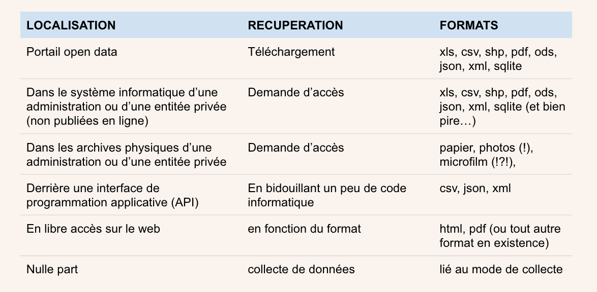
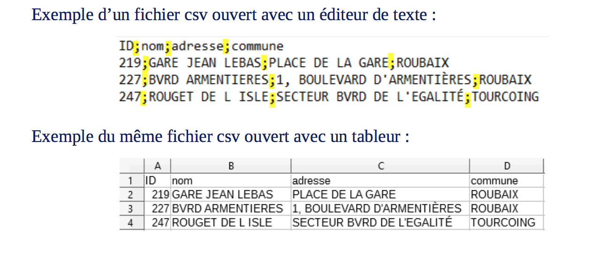
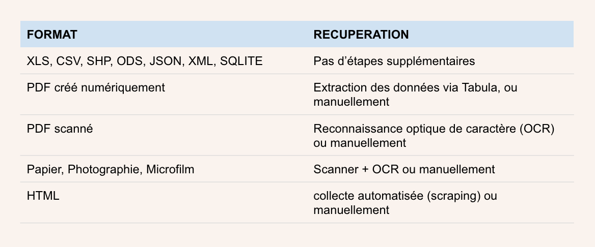

layout: true
  

`r paste0("
", params$event, " 

")` 

---

class: center, middle

Ces slides en ligne : `r paste0("http://datactivist.coop/", params$slug)`

Sources : `r paste0("https://github.com/datactivist/", params$slug)`

Les productions de Datactivist sont librement réutilisables selon les termes de la licence [Creative Commons 4.0 BY-SA](https://creativecommons.org/licenses/by-sa/4.0/legalcode.fr).

 
 

---

### Programme de la formation 

#### .red[Jour 2] - Open Data : l'ouverture des données publiques culturelles en pratique

* Identification des données 
* Les formats de données 
* Négociations et frictions dans l’ouverture des données : comment éviter les obstacles de l’open data ? 
* Extraction des données 
* Conversion et mise en qualité des données 
* Publication des données culturelles et production de métadonnées 
* Animation de l’open data et incitations à la réutilisation de données 
* Gouvernance des données et gestion de la relation avec les réutilisateurs 

---

---

class: inverse, center, middle

# 6 La conception d’une stratégie d’open data

---

class: middle

### Comment ouvrir ses données : .red[les différentes étapes] pratiques à suivre

* **Étape 1** : Sélectionner les données
* **Étape 2** : Préparer les données
* **Étape 3** : Diffuser et valoriser les données

---

### Étape 1 : .red[Sélectionner les données]

* Effectuer un état des lieux permettant de faire .red[**l’inventaire des données existantes.**] 
Cette opération permet également d'identifier d’éventuelles contraintes à l'ouverture et ainsi d'envisager les actions concrètes à mener.

* Enclencher la démarche en priorisant l’ouverture de certains jeux de données. 
.red[**Préférez les données demandées ou attendues par les réutilisateurs ou par des communautés**], comme par exemple : les données de fréquentation, de subvention, les données évènementielles et les images entrées dans le domaine public qui sont particulièrement recherchées.

.center[]

---

### Etape 2 : Préparer les données

#### Définir et documenter les jeux de données et leurs métadonnées

Joindre au fichier de données, à chaque fois que cela est utile, une notice explicative permettant de rendre les 
données plus explicites, et d'en éclairer l'usage possible. .red[**Ces informations sont indispensables et donnent un maximum de visibilité à vos données dans les moteurs de recherche**.] 

Cette notice pourra comprendre les éléments suivants : 

* La description générale du fichier
* Le contexte et les possibles alertes sur l’interprétation de la donnée (par exemple, préciser la fermeture d'un établissement et indiquer la période concernée afin d'expliquer la baisse de fréquentation observée, etc.)
* Le détail des ruptures de séries et son historique
* Un dictionnaire des différentes variables présentes dans le fichier, la signification en clair des codes des libellés des champs. 

---

### Etape 2 : Préparer les données

#### Choisir le format de mise à disposition

Les données doivent être téléchargeables dans un « standard ouvert », c'est à dire dans un format ouvert aisément réutilisable et exploitable par un système de traitement automatisé et pérenne.

Voici quelques exemples de formats « ouverts » conseillés pour la diffusion des jeux de données en ligne : 

* CSV, ODS, XLSX (données tabulaires),
* JSON, XML, RDF (données hiérarchiques),
* PNG, JPEG, TIFF (image),
* SHP, KML, GeoJSON (données géographiques),
* X3D (données 3D).

---

### Etape 2 : Préparer les données

#### Veiller à la qualité des données

Quelques principes à retenir :

* Mettre à disposition des séries chronologiques les plus longues possibles avec la granularité la plus fine, tout en respectant le secret de la vie privée et le secret statistique ; 
* Compléter vos fichiers par les données de géolocalisation quand cela est possible ;
* Compléter l'adresse postale par le code INSEE (afin de faciliter la géolocalisation dans le cas des noms de villes homonymes) ;
* Utiliser la norme ISO 8601 pour les dates, format : « AAAA-MM-JJ ».

#### Choisir la licence de réutilisation

Le contrat de licence de réutilisation permet de déterminer les droits et obligations réciproques des parties. Il est important que toutes les réutilisations, y compris celles consenties à titre gratuit, soient conditionnées à l'acceptation d'un contrat, et que l'usager en soit clairement informé. 

---
### Réussir sa stratégie d'ouverture des données 

- Au-delà de l'obligation légale : .red[**poser les objectifs**] poursuivis par la stratégie

- Se donner les moyens de connaître la .red[**demande de données**] pour y répondre 

- Travailler à la .red[**qualité des données**], garante d'usages réels

- Mener le projet d'ouverture des données comme un projet de modernisation de l'administration (transversalité, agilité, lean...)

---
### Des politiques d'open data "de l'offre"

.pull-left[
### En théorie

#### Toutes les données sont ouvertes sous leur forme brute dès leur production

]
.pull-right[

### En pratique

#### L’administration choisit quelles données ouvrir, comment les ouvrir, quand et ce qu’elles contiennent

]

---
### La réutilisation : un parcours fait de frictions et de déceptions
.pull-left[

]
.pull-right[
####  Des données difficiles à trouver, pas ouvertes partout

####  Granularité temporelle et spatiale souvent trop faible

####  Des données souvent inutilisables : manque de documentation

####  Des données pas mises à jour

####  Des portails qui ciblent les développeurs

]

---
### Le problème de la qualité des données

> **Les données des gouvernements sont souvent incomplètes, pas actualisées, de mauvaise qualité et fragmentaires.** 

> Dans la plupart des cas, les catalogues ou portails de données ouvertes sont alimentés manuellement, conséquence d’une approche informelle de la gestion des données. 

> De plus, les procédures, les calendriers et les responsabilités des institutions publiques chargées de leur gestion manquent souvent de clarté. Ainsi, de manière générale, la gestion et la publication des données ouvertes sont fragiles et sujettes à des erreurs multiples.

.footnote[Source : 
[Rapport mondial du 4e Open Data Barometer](https://opendatabarometer.org/4thedition/report/?lang=fr)
]
---
### Des données bien cachées
.pull-left[

]
.pull-right[
"La découvrabilité des données est un défi majeur. Nous avons des portails et des registres de données, mais les organismes gouvernementaux qui relèvent d'un seul gouvernement national publient toujours les données de différentes façons et à différents endroits (...).

**La découvrabilité des données est une condition préalable pour que les données ouvertes réalisent leur potentiel et, actuellement, la plupart des données sont très difficiles à trouver**."]

.footnote[https://index.okfn.org/insights/]

---

### Résumé : les facteurs clés de succès

* Obtenir un soutien au plus haut niveau

* Configurer l’organisation pour l’ouverture 

* Faciliter la découverte et l’utilisation des données 

* Rester à l'écoute et interagir avec les usagers 

---
### Exercice : les bénéfices de l'open data

.pull-left[

]
.pull-right[
En petits groupes, analysez les [données brutes](https://docs.google.com/spreadsheets/d/1pua5fDx8gtF3R9tce9wE7wmT0ksIFjscOO7DS723iHY/edit#gid=0) et syntéhtisez  : 
* La production d’effets bénéfiques ou d’externalités positives
* L'optimisation de la collecte et du partage des données
* L'amélioration de la qualité des données
* La production d'effets négatifs ou d'impacts contre-productifs
]

class: inverse, center, middle

### L’enjeu de qualité des données

---

### Des formats qui diffèrent suivant la localisation des données 

→ Où se trouvent les données ?
→ Sous quel format sont-elles conservées ?

---

### Les formats ouverts

Les formats ouverts favorisent l’intéropérabilité : les
données pourront être réutilisées indépendamment du logiciel qui a été utilisé pour
les créer.

Les principaux formats ouverts sont :
* **Texte brut** : ASCII (.txt) / sans extension
* **Texte formaté** : TeX (.tex), OpenDocument Text (.odt), Hypertext Markup
Language (.htm ou .html), XHTML (.xhtml), Feuilles de style en cascade (.css)
* **Données brutes** : CSV (.csv) / sans extension, JSON (.json), XML (.xml)
* **Données géographiques** : KML (.kml), SHP (.shp)

---

### Les formats de données structurées

.pull-left[

**JSON**
> JSON est un format de fichier tabulaire utile pour un traitement simplifié par les ordinateurs. 

**XML**
> XML est un format largement utilisé pour l’échange de données, car il conserve la structure des données et la façon dont les fichiers sont construits, et permet aux développeurs d’écrire des parties de la documentation avec les données sans interférer avec leur lecture.

]

.pull-right[

**CSV**
> Les fichiers CSV sont compacts et permetttent de transférer de larges ensembles de données en conservant la même structure.  Il s’agit d’un fichier texte composé uniquement de caractères organisés de façon tabulaire.

]

---

### Les formats propriétaires 

Les formats des fichiers sont nombreux et sont spécifiques à des types de fichier : texte, audio, vidéo,
image, tableur, etc. On peut distinguer les formats dits ouverts aux formats dits fermés. 

Les formats fermés n'appartiennent pas au domaine public. Leur recette de fabrication est cachée, et vous serez le plus souvent contraint d'avoir le logiciel adéquat pour pouvoir lire et
modifier un fichier convenablement. Par exemple pour lire un fichier au format .doc (Microsoft Word), vous serez contraint d'avoir le logiciel Word.

* **Des alternatives à la suite Microsoft**

Microsoft a tenté d'ouvrir les formats de sa suite Microsoft Office. Toutes ses extensions terminant
par un x (.docx, .pptx, .xlsx) sont des formats sortis dans un but d'interopérabilité. Toutefois leur
aspect ouvert fait encore débat. 

> Tous les formats propriétaires ne sont pas fermés. Pour reprendre le cas d'Adobe, son format
.pdf est devenu un standard (norme ISO). Tout le monde peut ouvrir un fichier PDF.

---

### Ce que les formats impliquent pour .red[le traitement des données]

Afin de pouvoir traiter, analyser, lire ou visualiser des données, il faut pouvoir les manipuler. 
Le format est important parce qu'il détermine les opérations de traitement nécessaires à la réutilisation de données. 

---

### Accessibilité des formats des données .red[pour les humains et pour les machines]

.footnote[Source : Françoise Paquienséguy, Valentyna Dymytrova. Livrable 1.2 Analyse de portails métropolitains de données ouvertes à l’échelle internationale. Rapport de recherche 1.2, Equipe d’accueil lyonnaise en Sciences de l’information et de la communication. 2017. ffhal-01449348f] 

---

### [WTFCSV](https://databasic.io/en/wtfcsv/) : un outil pour prévisualiser un jeu de données en .csv

---

class: inverse, center, middle

# Le cycle de l'ouverture des données

---
### Open Data Pipeline : les principales étapes de l'ouverture

.reduite.center[

]

---
### La circulation des données provoque des frictions

>Chaque mouvement de données à travers une interface a un coût en temps, en énergie et en attention humaine. Chaque interface entre les groupes et les organisations, ainsi qu'entre les machines, représente un point de résistance où les données peuvent être brouillées, mal interprétées ou perdues. 
>Dans les systèmes sociaux, la friction des données consomme de l'énergie et produit de la turbulence et de la chaleur - c'est-à-dire des conflits, des désaccords et des processus indisciplinés et inexacts.

Edwards, P. N. et al. (2011) [‘Science friction: Data, metadata, and collaboration’](https://journals.sagepub.com/doi/abs/10.1177/0306312711413314), _Social Studies of Science_, 41(5)

---
### Identifier

.pull-left[

]

.pull-right[
* Rencontrer les agents

* Etudier les données ouvertes par d'autres collectivités

* Cartographier les données

* Documenter les données

]

---
### Valider

.pull-left[

]

.pull-right[
* Evaluer les jeux de données

* Prioriser l’ouverture 

* Valider l’ouverture par la hiérarchie

]

---
### Quelques “bonnes raisons organisationnelles” de ne pas ouvrir des données

* Des données encastrées dans les systèmes d’information : explorer les bases de données, reconstruire les schémas et extraire les données

* Des données qui peuvent servir à des usagers malveillants : prévoir les risques et les dangers de l’ouverture

* Des données qui n’ont pas été pensées pour l’ouverture : améliorer leur qualité et leur intelligibilité 

* Des données trop “sensibles” pour être ouvertes : la transparence, un mandat à obtenir 

---
### Éditer

.pull-left[

]

.pull-right[
_data editing_: les opérations par lesquelles les statisticiens traitent et transforment les données issues des sources administratives (Desrosières 2005) 

* Anonymiser des données 

* Enlever la sensibilité de données qui ne pouvaient pas être publiées

* Rendre intelligible les acronymes 

* Améliorer la qualité des données

]

---
### Le sprint qualité des données de la FING

Le “sprint qualité” est une méthodologie sur un temps court, 2h30, qui vise l’amélioration significative de la qualité d’un, et un seul, jeu de données.

Petit exercice : en groupe, sélectionnez un jeu de données et essayez d'appliquer 5 points de contrôle 

---
### [Dataproofer](http://dataproofer.org/) : un outil de contrôle automatique de la qualité

---
### Standardiser

.pull-left[

]

.pull-right[
* Convertir les données dans un format ouvert (spécifications techniques publiques et sans restriction d'accès ni de mise en œuvre) et lisible par les machines

* Adopter des spécifications partagées : GTFS, DECP, IATI, OCDS, socle commun des données locales…

* Transformer les données

]

---
### Passage en CSV : bien plus que “enregistrer sous”

---
### Publier

.pull-left[

]

.pull-right[
* Importer les données sur le portail

* Décrire les champs du fichier

* Documenter les métadonnées
]

---
### [Datasheet for Datasets](https://teamopendata.org/t/traduction-et-adaptation-du-modele-de-description-des-donnees-datasheet-for-datasets/1400) : un modèle de documentation des données

.reduite.center[

]

---
### Mettre à jour

.pull-left[

]

.pull-right[

* Mettre à jour manuellement ou automatiser l’ouverture

* Conserver les données

* Prendre en compte les retours des usagers

]

---
class: inverse, center, middle

# Merci !

Contact : [joel@datactivist.coop](mailto:joel@datactivist.coop)

